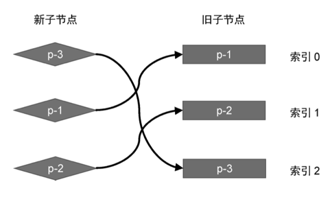

# Vue.js 设计与实现

## 第一篇 框架设计概览

### 第 1 章 权衡的艺术

#### 1.3 虚拟 DOM 的性能到底如何

```html
<!DOCTYPE html>
<html lang="en">
  <head>
    <meta charset="UTF-8" />
    <title>DOM Operation Performance Test</title>
    <script>
      // 准备一个用于显示结果的函数
      function showResult(method, time) {
        const resultDiv = document.getElementById('results')
        const p = document.createElement('p')
        p.textContent = `使用 ${method} 耗时：${time} ms`
        resultDiv.appendChild(p)
      }

      // 使用 innerHTML 的测试
      function testInnerHTML() {
        let start1 = performance.now()
        let container1 = document.createElement('div')
        for (let i = 0; i < 10000; i++) {
          container1.innerHTML += '<div></div>'
        }
        let end1 = performance.now()
        showResult('innerHTML', end1 - start1)
      }

      // 使用 document.createElement 的测试
      function testCreateElement() {
        let start2 = performance.now()
        let container2 = document.createElement('div')
        for (let i = 0; i < 10000; i++) {
          let div = document.createElement('div')
          container2.appendChild(div)
        }
        let end2 = performance.now()
        showResult('document.createElement', end2 - start2)
      }
    </script>
  </head>
  <body>
    <h1>DOM 操作性能测试</h1>
    <button onclick="testInnerHTML()">测试 innerHTML</button>
    <button onclick="testCreateElement()">测试 document.createElement</button>
    <div id="results"></div>
  </body>
</html>
```

> 消耗的时间完全不是一个级别的，

#### 1.4 运行时和编译时

    1. 纯运行时

它提供 一个 `Render` 函数，用户可以为该函数提供一个树型结构的数据对 象，然后 `Render` 函数会根据该对象递归地将数据渲染成 `DOM` 元 素。我们规定树型结构的数据对象如下：

```js
const obj = {
  tag: 'div',
  children: [{ tag: 'div', children: 'hello world' }],
}
```

每个对象都有两个属性：`tag` 代表标签名称，`children` 既可以 是一个数组（代表子节点），也可以直接是一段文本（代表文本子节 点）。接着，我们来实现 `Render` 函数：

```js
function render(obj, root) {
  let el = document.createElement(obj.tag)
  if (typeof obj.children === 'string') {
    el.appendChild(document.createTextNode(obj.children))
  } else if (obj.children instanceof Array) {
    obj.children.forEach(item => {
      render(item, el)
    })
  }
  root.appendChild(el)
}
```

    2. 运行时 + 编译时

编译`Compiler`是将一个 `html` 的字符串编译成类似 `obj` [58 行 obj 对象](#L58),然后就可以执行 `render`。

    3. 纯编译时

既然是有一个 `html` 然后操作`dom`生成真实的 `dom`。那么我们可以跳过 `render` 直接通过 `Compiler` 执行编译时操作。这就是纯编译

### 第 2 章 框架设计的核心要素

#### 2.1 提升用户的开发体验

以 `Chrome` 为例，我们可以打开 `settings` 的设置`perferences`，然后勾选“Console”→“Enable custom formatters”选项。
这样能够更好的展示第三方框架的对象

```js
 const count = ref(0)
console.log(count)
  // 打开前
RefImpl {__v_isShallow: false, dep: undefined, __v_isRef: true, _rawValue: 0, _value: 0}
// 打开后
Ref<0>
```

#### 2.3 框架要做到良好的 Tree-Shaking

```js
// input.js

// 导入 foo 函数从 utils.js 模块
import { foo } from './utils.js'

// 调用 foo 函数
foo()

// utils.js

// 导出 foo 函数，接受一个参数 obj
export function foo(obj) {
  return obj && obj.foo
}

// 导出 bar 函数，接受一个参数 obj
export function bar(obj) {
  return obj && obj.bar
}
```

执行如下命令进行构建：

```shell
    npx rollup input.js -f esm -o bundle.js
```

> `-f` 是 `--format` 的缩写，用于指定生成的打包文件的模块格式。在这个命令中，你设置了 -f esm，意思是将生成的打包文件以 ES 模块（ESM）的格式输出。ESM 是一种用于 `JavaScript` 模块化的标准，它允许你在代码中使用 `import` 和 `export` 关键字来导入和导出模块。通过使用 ES 模块格式，你可以在浏览器环境中或其他支持 ESM 的环境中更有效地加载和使用你的代码。
> -o 是 --file 的缩写，用于指定生成的打包文件的输出路径和文件名。在这个命令中，你设置了 `-o bundle.js`，表示生成的打包文件将保存在名为 `bundle.js` 的文件中。`Rollup` 将会把所有打包后的代码和模块输出到这个文件中，以供后续在浏览器或其他环境中使用。

```js
// bundle.js
function foo(obj) {
  return obj && obj.foo
}
foo()
```

可以看到，其中并不包含 bar 函数，这说明 Tree-Shaking 起了作 用。由于我们并没有使用 bar 函数，因此它作为 dead code 被删除了。 但是仔细观察会发现，foo 函数的执行也没有什么意义，仅仅是读取 了对象的值，所以它的执行似乎没什么必要。既然把这段代码删了也 不会对我们的应用程序产生影响，那么为什么 rollup.js 不把这段代码也 作为 dead code 移除呢？

这就涉及 Tree-Shaking 中的第二个关键点——副作用。如果一个 函数调用会产生副作用，那么就不能将其移除。什么是副作用？简单 地说，副作用就是，当调用函数的时候会对外部产生影响，例如修改 了全局变量。这时你可能会说，上面的代码明显是读取对象的值，怎 么会产生副作用呢？其实是有可能的，试想一下，如果 obj 对象是一 个通过 Proxy 创建的代理对象，那么当我们读取对象属性时，就会触 发代理对象的 get 夹子（trap），在 get 夹子中是可能产生副作用 的，例如我们在 get 夹子中修改了某个全局变量。而到底会不会产生 副作用，只有代码真正运行的时候才能知道，JavaScript 本身是动态语 言，因此想要静态地分析哪些代码是 dead code 很有难度，上面只是举 了一个简单的例子。

因为静态地分析 JavaScript 代码很困难，所以像 rollup.js 这类工具 都会提供一个机制，让我们能明确地告诉 rollup.js：“放心吧，这段代 码不会产生副作用，你可以移除它。”具体怎么做呢？如以下代码所 示，我们修改 input.js 文件：

```js
import { foo } from './utils'
/*#__PURE__*/ foo()
```

注意注释代码 `/*#__PURE__*/`，其作用就是告诉 `rollup.js`，对于 foo 函数的调用不会产生副作用，你可以放心地对其进行 `TreeShaking`，此时再次执行构建命令并查看 `bundle.js` 文件，就会发现它的 内容是空的，这说明 `Tree-Shaking` 生效了。

### 第 3 章 Vue.js 3 的设计思路

#### 3.2 初识渲染器

虚拟 dom 其实就是我们的的 js 对象，通过渲染器将虚拟 dom 渲染成真实 dom

```html
<!DOCTYPE html>
<html lang="en">
  <head>
    <meta charset="UTF-8" />
    <title>DOM Operation Performance Test</title>
  </head>
  <body>
    <div id="app"></div>
    <script>
      function render(vnode, container) {
        if (typeof vnode === 'string') {
          const textNode = document.createTextNode(vnode)
          return container.appendChild(textNode)
        }
        const dom = document.createElement(vnode.tag)
        if (vnode.attrs) {
          Object.keys(vnode.attrs).forEach(key => {
            if (/^on[A-Z,a-z]/.test(key)) {
              dom.addEventListener(key.slice(2).toLowerCase(), vnode.attrs[key])
            } else if (key === 'className') {
              dom.setAttribute('class', vnode.attrs[key])
            } else {
              dom.setAttribute(key, vnode.attrs[key])
            }
          })
        }
        if (Array.isArray(vnode.children)) {
          vnode.children.forEach(child => render(child, dom))
        } else if (vnode.children !== undefined && vnode.children !== null) {
          render(vnode.children, dom)
        }
        return container.appendChild(dom)
      }
      let obj = {
        tag: 'div',
        attrs: {
          id: 'newApp',
          onclick: () => alert('click'),
        },
        children: 'test',
      }
      render(obj, document.getElementById('app'))
    </script>
  </body>
</html>
```

#### 3.3 组件的本质

组件就是一

组件就是一组 DOM 元素的封装 ，这组 DOM 元素就是组件要渲染的内容，因此 我们可以定义一个函数来代表组件，而函数的返回值就代表组件要渲染的内容：

- 函数式

```js
const MyComponent = function () {
  return {
    tag: 'div',
    attrs: {
      id: 'component',
      onclick: () => alert('click'),
    },
    children: 'test',
  }
}
```

- 对象式

```js
const MyComponent = {
  render() {
    return {
      tag: 'div',
      attrs: {
        id: 'component',
        onclick: () => alert('click'),
      },
      children: 'test',
    }
  },
}
```

#### 3.4 模版的工作原理

编译器：无论是手写虚拟 DOM（渲染函数）还是使用模板，都属于声明式 地描述 UI，并且 Vue.js 同时支持这两种描述 UI 的方式。编译器的作用其实就是将模板编译为渲染函数，

## 第二篇 响应系统

### 第 4 章 响应系统的作用与实现

#### 4.2 响应式数据的基本实现

```js
const bucket = new Set()
let data = {
  text: 'hello world',
}
const obj = new Proxy(data, {})
```

#### 4.3 一个完整的响应式

> 响应式数据，和`effect`副作用函数，一个简单的响应式

```html
<!DOCTYPE html>
<html lang="en">
  <head>
    <meta charset="UTF-8" />
    <title>Title</title>
  </head>
  <body>
    <script>
      const data = { text: 'hello world' }
      let activeEffect // 当前的执行的副左右
      const bucket = new WeakMap() // 副作用函数的桶 使用WeakMap , eg:{foo:1,bar:2},当foo的副左右被执行完之后，会在weakmap清理，在local中长度变成1。

      function effect(fn) {
        activeEffect = fn
        fn() // 执行副作用函数
      }
      // 响应式数据
      const obj = new Proxy(data, {
        get(target, p, receiver) {
          track(target, p) // 抽离出来进行依赖的收集，在lazy时，可以手动的进行收集依赖
          return Reflect.get(...arguments)
        },
        set(target, p, value, receiver) {
          Reflect.set(...arguments) // 设置属性值
          trigger(target, p) // 把副作用函数取出并执行，同理，在
          return Reflect.set(...arguments)
        },
      })

      // track函数 依赖收集
      function track(target, key) {
        if (!activeEffect) return target[key] // 没有正在执行的副作用函数 直接返回
        let depsMap = bucket.get(target)
        if (!depsMap) {
          // 不存在，则创建一个Map
          bucket.set(target, (depsMap = new Map()))
        }
        let deps = depsMap.get(key) // 根据key得到 depsSet(set类型), 里面存放了该 target-->key 对应的副作用函数
        if (!deps) {
          // 不存在，则创建一个Set
          depsMap.set(key, (deps = new Set()))
        }
        deps.add(activeEffect) // 将副作用函数加进去
      }

      // trigger函数 副作用执行
      function trigger(target, key) {
        const depsMap = bucket.get(target) // target Map
        if (!depsMap) return true
        const effects = depsMap.get(key) // effectFn Set
        effects && effects.forEach(fn => fn())
        return true // 返回true
      }

      effect(() => {
        console.log('effect run')
        document.body.innerHTML = obj.text
      })

      setTimeout(() => {
        obj.text = 'heeeeeeeeee'
      }, 1000)
    </script>
  </body>
</html>
```

#### 4.4 分支切换和 cleanup

```js
effect(() => {
  console.log('effect run')
  document.body.innerHTML = obj.ok ? obj.text : 'no'
})

setTimeout(() => {
  obj.ok = false
}, 1000)

setTimeout(() => {
  obj.text = 'ds'
}, 2000)
```

> 对于上面的分支的问题，我们可以看到，在 2s 的`obj.text`的修改不应该在执行副作用函数，
> 所以思路是，如果在当前的副作用函数中，会把相同的`effect`只执行一次，同时清空其他`key`关联的相同的`effect`,然后执行当前的`effect`, 如果没有使用当前的对应`key`的响应式数据，那么这个副作用函数就是无效的副作用，就不会被依赖收集，在 2s 修改的`obj.text`就不会触发`effect`的执行。而且在这里使用一个新的`Set`，这样就不会循环调用的情况，而且也不会添加相同地址的副作用函数，

- 解决方案是：

  ```js
  function effect(fn) {
    const effectFn = () => {
      // 副作用函数执行之前，将该函数从其所在的依赖集合中删除
      cleanup(effectFn)
      // 当effectFn执行时，将其设置为当前激活的副作用函数
      activeEffect = effectFn
      fn()
    }
    effectFn.deps = [] // activeEffect.deps用来存储所有与该副作用函数相关联的依赖集合
    effectFn()
  }
  function cleanup(effectFn) {
    for (let i = 0, len = effectFn.deps.length; i < len; i++) {
      let deps = effectFn.deps[i] // 依赖集合
      deps.delete(effectFn)
    }
    effectFn.deps.length = 0 // 重置effectFn的deps数组
  }
  ```

#### 4.5 嵌套的 effect 和 effect 栈

> 在 vue 中，`render`就是一个`effect`，所以使用一个`vue`的组件就是有嵌套`effect`，所以`effect`的嵌套是很常见和使用的，

```js
let tmp1, tmp2
effect(() => {
  console.log('eff1')
  effect(() => {
    console.log('eff2')
    tmp1 = obj.bar
  })
  tmp2 = obj.foo
})
```

> 在上面的 `effect` 中，会出现在收集依赖的时候只会收集 `eff2` ，因为在 `effect` 中在指向 `activeEffect` 时，先收集`obj.bar` ，在收集完成里面的 `effect` ，然后在收集 `effect2`。从而导致问题的出现，解决就是，使用栈的逻辑，先进后出。

```js
let activeEffect, effectStack

function effect(fn) {
  const effectFn = () => {
    // 副作用函数执行之前，将该函数从其所在的依赖集合中删除
    cleanup(effectFn)
    // 当effectFn执行时，将其设置为当前激活的副作用函数
    activeEffect = effectFn
    effectStack.push(activeEffect) // 将当前副作用函数推进栈
    fn()
    // 当前副作用函数结束后，将此函数推出栈顶，并将activeEffect指向栈顶的副作用函数
    // 这样：响应式数据就只会收集直接读取其值的副作用函数作为依赖
    effectStack.pop()
    activeEffect = effectStack[effectStack.length - 1]
  }
  effectFn.deps = [] // activeEffect.deps用来存储所有与该副作用函数相关联的依赖集合
  effectFn()
}
function cleanup(effectFn) {
  for (let i = 0, len = effectFn.deps.length; i < len; i++) {
    let deps = effectFn.deps[i] // 依赖集合
    deps.delete(effectFn)
  }
  effectFn.deps.length = 0 // 重置effectFn的deps数组
}
```

#### 4.6 避免无限递归

```js
effect(() => {
  console.log(obj.num)
  obj.num++
})
```

> 在`effect`中同时执行`get`和`set`是，就会出现无限递归的情况，简单来说就是在执行`set`的同时出现了`effect`的收集，虽然在执行的`effects`时候进行了`cleanup`，但是在`effect`的内部，依然可以收集当前的`activeEffect`。所以过滤掉当前的`effect`

```js
// trigger函数
function trigger(target, key) {
  const depsMap = bucket.get(target) // target Map
  if (!depsMap) return
  const effects = depsMap.get(key) // effectFn Set
  const effectToRun = new Set()
  effects &&
    effects.forEach(effectFn => {
      // 增加守卫条件
      if (effectFn !== activeEffect) {
        // trigger触发执行的副作用函数如果和当前正在执行的副作用函数一样，就不触发执行
        effectToRun.add(effectFn)
      }
    })
  effectToRun &&
    effectToRun.forEach(fn => {
      if (typeof fn === 'function') fn()
    })
}
```

#### 4.7 调度执行(scheduler)

这个是后续实现`computed`和`watch`，提供增强功能，主要是用来是`vue`相关的函数。

```js
// 这是一个优化effect的队列

let jobQueue = new Set() // 任务队列,通过Set自动去重相同的副作用函数

const p = Promise.resolve() // 使用promise实例将任务添加到微任务队列

let isFlushing = false // 是否正在刷新队列
function flushJob() {
  if (isFlushing) return // 如果正在刷新，则什么也不做
  isFlushing = true // 正在刷新
  p.then(() => {
    // 将副作用函数的执行放到微任务队列中
    jobQueue.forEach(effectFn => effectFn()) // 取出任务队列中的所有副作用函数执行
  }).finally(() => {
    isFlushing = false // 重置刷新标志
  })
}
// trigger函数
function trigger(target, key) {
  const depsMap = bucket.get(target) // target Map
  if (!depsMap) return
  const effects = depsMap.get(key) // effectFn Set
  const effectToRun = new Set()
  effects &&
    effects.forEach(effectFn => {
      // 增加守卫条件
      if (effectFn !== activeEffect) {
        // trigger触发执行的副作用函数如果和当前正在执行的副作用函数一样，就不触发执行
        effectToRun.add(effectFn)
      }
    })
  effectToRun &&
    effectToRun.forEach(fn => {
      if (fn.options.scheduler) {
        // 该副作用函数选项options中的调度器函数存在
        fn.options.scheduler(fn)
      } else {
        // 如果不存在scheduler调度函数，则直接调用副作用函数
        fn()
      }
    })
}

effect(
  () => {
    console.log(obj.foo)
  },
  {
    scheduler(fn) {
      // 每次调度时, 将副作用函数添加到任务队列中。注意：同一个副作用函数加进去会由于jobQueue是Set而去重
      // 当宏任务完成后，值已经是最终状态，中间状态的值不会通过副作用函数体现出来
      jobQueue.add(fn)
      // 调用flushJob刷新队列
      flushJob()
    },
  }
)

obj.foo++
obj.foo++

console.log(`over`)
```

在这里，通过`scheduler`函数，将`effect`的执行放到`jobQueue`中，然后在`flushJob`中执行，这样就可以在`effect`中多次修改值，只会执行一次`effect`，而且是最终的值。

#### 4.8 计算属性`computed`和`lazy`

> 计算属性可以一对多，同时监控多个属性或者`getter`。同时实现第一次不执行，手动执行`computed`，这样就可以实现`lazy`的效果。

```js
function effect(fn, options = {}) {
  const effectFn = () => {
    // 副作用函数执行之前，将该函数从其所在的依赖集合中删除
    cleanup(effectFn)
    // 当effectFn执行时，将其设置为当前激活的副作用函数
    activeEffect = effectFn
    effectStack.push(activeEffect) // 将当前副作用函数推进栈
    const res = fn() // lazy选项，getter函数，执行的结果res
    // 当前副作用函数结束后，将此函数推出栈顶，并将activeEffect指向栈顶的副作用函数
    // 这样：响应式数据就只会收集直接读取其值的副作用函数作为依赖
    effectStack.pop()
    activeEffect = effectStack[effectStack.length - 1]
    return res // 将函数的结果传递出去，配合lazy选项
  }
  effectFn.deps = [] // activeEffect.deps用来存储所有与该副作用函数相关联的依赖集合
  effectFn.options = options // 将用户传进来的options挂载到副作用函数effectFn上
  if (options.lazy) {
    // lazy的话就把副作用函数返回出去
    return effectFn
  } else {
    // 否则就立即执行该副作用函数
    effectFn()
  }
}

// 传递给effect函数注册的才是真正的副作用函数(getter),effectFn是包装过后的函数
// 通过执行包装后的effectFn函数可以得到副作用函数的结果,下面为obj.foo+obj.bar的结果
// const effectFn = effect(
//     () => obj.foo + obj.bar, // 将传递给effect的函数当做getter函数,该getter函数可以返回任何值
//     {
//         lazy: true
//     }
// )
// const value = effectFn()
// console.log(value)

function computed(getter) {
  // 缓存设置
  let value,
    dirty = true // true意味着脏，则需要重新调用effectFn进行计算得到结果

  const effectFn = effect(getter, {
    lazy: true,
    scheduler(fn) {
      // fn() // 此处看控制台
      // const res = fn() // 此处要不要fn()都无所谓，因为不会产生影响，computed是一个计算属性，副作用函数是个getter
      // console.log('res', res)
      dirty = true // 通过调度器，将dirty设为脏
      // computed依赖的响应式数据变化时，手动调用trigger函数触发响应
      trigger(obj, 'value')
    },
  })

  const obj = {
    get value() {
      // value属性是一个getter，当被obj.value时就会执行包装的副作用函数effectFn得到getter副作用的结果
      if (dirty) {
        value = effectFn()
        dirty = false
      }
      if (activeEffect) {
        // 当读取value时，手动调用track函数进行追踪
        track(obj, 'value')
      }
      return value
    },
  }

  return obj
}
const o = computed(() => {
  console.log('effect Fn')
  return obj.foo + obj.bar
})
console.log(o.value)
obj.foo++
console.log(o.value)

console.log('-----------------------------------')
effect(() => {
  console.log('另一个effect调用computed计算属性')
  console.log(o.value)
})

obj.foo++
```

通过`lazy`属性可以在第一时间暂停`computed`，可以在最后在使用(在`obj.foo`和`obj.bar`的次变化之后)。通过设置`dirty`避免多次读取计算属性，带来的重新计算负担，而`activeEffct`的判断，就是收集所有的和计算属性的副作用，从而实现响应式数据。对应调度器`scheduler`，是在`trigger`中执行，同时执行：设置数据为脏数据，更新相关的依赖的副作用函数，从而实现`computed`的更新。

#### 4.9 watch

`watch`属性和`computed`类似，但是`watch`是一个副作用函数，而`computed`是一个`getter`，所以`watch`可以执行副作用函数，而`computed`不可以。`watch`的实现和`computed`类似，只是在`effect`中，不需要设置`lazy`属性，同时在`trigger`中，不需要设置`dirty`属性，因为`watch`是一个副作用函数，所以每次都需要执行。

```js
// watch函数，source是响应式数据，cb回调函数
function watch(source, cb) {
  let getter
  if (typeof source === 'function') {
    // 说明传递进来的是一个getter函数,只需要watch这个getter函数的返回值
    getter = source
  } else {
    getter = () => traverse(source)
  }
  let oldValue, newValue
  const effectFn = effect(
    () => {
      // return source.foo // 读取操作，建立响应式的关系
      // return traverse(source) // 递归读取响应式数据的所有属性
      return getter() // 调用getter函数，要么是读取所有属性，要么是读取特定属性
    },
    {
      lazy: true,
      scheduler(fn) {
        newValue = fn() // 数据更新时调用副作用函数，并将更新的值放到newValue上
        cb(oldValue, newValue)
        oldValue = newValue // 更新旧值
      },
    }
  )
  oldValue = effectFn()
}

// 遍历source读取
function traverse(value, seen = new Set()) {
  // source是原始值, null, 或者已经读取过，就直接返回
  if (typeof value !== 'object' || value === null || seen.has(value)) return
  seen.add(value)
  // 不考虑数组等结构，只考虑source是一个对象
  // for in 读取对象的每一个值
  for (const k in value) {
    traverse(value[k], seen)
  }
  return value
}

// 此处如果watch的是整个响应式数据，则无法取得oldValue和newValue
watch(
  () => obj.foo,
  (oldValue, newValue) => {
    console.log('watch!')
    console.log('oldValue: ', oldValue, 'newValue: ', newValue)
  }
)

obj.foo++
```

通过`watch`函数，可以实现对响应式数据的监听，同时可以监听到旧值和新值，从而实现`watch`的功能。一共是两种监听方式，第一个就是`getter`，可以实现同时监听多个属性，在`oldValue`和`newValue`中，获取的是一个数组，可以通过结构同时获取到多个旧值和新值，第二个就是监听整个响应式数据，但是无法获取到旧值和新值。

```js
watch(obj.foo, (oldValue, newValue) => {
  console.log('watch!')
  console.log('oldValue: ', oldValue, 'newValue: ', newValue)
})
obj.foo++
```

这里如果监听的是简单数据的话，会造成依赖的收集过早，导致 watch 不能监听数据的变化。所以在`vue`中，并不是直接监听简单数据，而是对简单数据进行包装成一个对象，从而监听的是一个对象的某个属性。

#### 4.10 立即执行的 watch 和回调执行的时机

控制`watch`执行的时机，在`vue2`中，可以使用`this.&nextTick`，在`vue3`中，可以使用`scheduler`函数，从而实现`watch`的执行时机。

```js
// watch函数，source是响应式数据，cb回调函数
function watch(source, cb, options = {}) {
  let getter
  if (typeof source === 'function') {
    // 说明传递进来的是一个getter函数,只需要watch这个getter函数的返回值
    getter = source
  } else {
    getter = () => traverse(source)
  }
  let oldValue, newValue

  function job() {
    newValue = effectFn() // 数据更新时调用副作用函数，并将更新的值放到newValue上
    cb(oldValue, newValue)
    oldValue = newValue // 更新旧值
  }

  const effectFn = effect(
    () => {
      // return source.foo // 读取操作，建立响应式的关系
      // return traverse(source) // 递归读取响应式数据的所有属性
      return getter() // 调用getter函数，要么是读取所有属性，要么是读取特定属性
    },
    {
      lazy: true,
      scheduler(fn) {
        // flush如果是post,放到微任务队列中执行
        if (options.flush === 'post') {
          // 会执行n次
          // const p = Promise.resolve()
          // p.then(() => job())
          // 只执行一次，不关心中间状态
          jobQueue.add(job)
          flushJob() // flushJob函数加了第一个参数，用于此处.
        } else job()
      },
    }
  )
  if (options.immediate) {
    job() // 直接触发scheduler函数，里面会触发cb
  } else {
    oldValue = effectFn() // 执行一次副作用函数, 但不执行cb，因为cb是在数据更新的时候通过scheduler进行调用的
  }
}
// 此处如果watch的是整个响应式数据，则无法取得oldValue和newValue
watch(
  () => obj.foo,
  (oldValue, newValue) => {
    console.log('oldValue: ', oldValue, 'newValue: ', newValue)
  },
  {
    // immediate: true, // 立即执行一次cb
    flush: 'post', // cb执行时机,在更新后。取值: post, sync, pre
  }
)

obj.foo++
obj.foo++
obj.foo++
obj.foo++
obj.foo++
```

#### 4.11 过期的副作用函数

```js
function watch(source, cb, options = {}) {
  let getter
  if (typeof source === 'function') {
    // 说明传递进来的是一个getter函数,只需要watch这个getter函数的返回值
    getter = source
  } else {
    getter = () => traverse(source)
  }
  let oldValue, newValue
  let cleanup // cleanup用来保存上一次回调的过期处理函数
  function onInvalidate(fn) {
    cleanup = fn
  }

  function job() {
    newValue = effectFn() // 数据更新时调用副作用函数，并将更新的值放到newValue上
    if (cleanup) cleanup() // 如果上一次回调注册了过期处理函数，则先执行过期处理函数
    cb(oldValue, newValue, onInvalidate)
    oldValue = newValue // 更新旧值
  }

  const effectFn = effect(
    () => {
      return getter() // 调用getter函数，要么是读取所有属性，要么是读取特定属性
    },
    {
      lazy: true,
      scheduler(fn) {
        // flush如果是post,放到微任务队列中执行
        if (options.flush === 'post') {
          // 会执行n次
          // const p = Promise.resolve()
          // p.then(() => job())
          // 只执行一次，不关心中间状态
          jobQueue.add(job)
          flushJob() // flushJob函数加了第一个参数，用于此处.
        } else job()
      },
    }
  )
  if (options.immediate) {
    job() // 直接触发scheduler函数，里面会触发cb
  } else {
    oldValue = effectFn() // 执行一次副作用函数, 但不执行cb，因为cb是在数据更新的时候通过scheduler进行调用的
  }
}
watch(obj, async (newValue, oldValue, onInvaliddate) => {
  let expire = false
  onInvaliddate(() => {
    expire = true
  })
  // 模拟请求 (这个请求是2s)
  const res = await fetch('http://localhost:3000/api')
  if (!expire) {
    console.log(res)
  }
})
obj.foo++
setTimeout(() => {
  obj.foo++
}, 200)
```

如以上代码所示，我们修改了两次`obj.foo`的值，第一次修改是 立即执行的，这会导致 `watch` 的回调函数执行。由于我们在回调函数 内调用了 `onInvalidate`，所以会注册一个过期回调，接着发送请求 A。假设请求 A 需要 1000ms 才能返回结果，而我们在 200ms 时第二次 修改了 `obj.foo` 的值，这又会导致 `watch` 的回调函数执行。这时要 注意的是，在我们的实现中，每次执行回调函数之前要先检查过期回 调是否存在，如果存在，会优先执行过期回调。由于在 `watch` 的回调 函数第一次执行的时候，我们已经注册了一个过期回调，所以在 `watch` 的回调函数第二次执行之前，会优先执行之前注册的过期回 调，这会使得第一次执行的副作用函数内闭包的变量 `expired` 的值变 为 `true`，即副作用函数的执行过期了。于是等请求 A 的结果返回时， 其结果会被抛弃，从而避免了过期的副作用函数带来的影响。

### 第 5 章 非原始值的响应式方案

#### 5.1 理解 proxy 和 reflect

```js
const obj = {
    foo: 1,
    get bar() {
        return this.foo
    },
}
effect(){
    console.log(obj.bar)
}
p.foo++

```

在上面的代码中`p.foo++`在修改之后，没有执行`effect`，这是由于在执行的时候没有收集`obj.bar`的依赖，所以在修改`foo`的值之后，没有执行`effect`。所以我们需要在`get`中收集依赖，这样就可以在修改`foo`的值之后，执行`effect`。原因就是`target[key]`没有触发`effect`收集，这里的`trach`是`obj`属于非响应式数据，`Reflect.get`可以解决这个问题。

```js
const p = new Proxy(obj, {
  get(target, key, receiver) {
    track[(target, key)]
    return Reflect.get(target, key, receiver)
  },
})
```

这里的`receiver`指的是响应式数据`p`，这样就可以实现`effect`的收集。

#### 5.2 `javaScript`对象及`Proxy`的工作原理

在`javaScript`中，有两种对象，一种是常规对象，一种是异质对象。通过内部方法和内部槽来区份，例如函数对象就会部署`[[call]]`内部方法，而数组对象就会部署`[[length]]`内部槽。

#### 5.3 如何代理对象

在代理对象的时候，除了基础的`[[get]],[[set]]`，还有`for in `、`in`、`delete`。

##### in

对于`in`的操作，对应的是`[[HasProperty]]`，在`Proxy`中，对应的就是`has`。

```js
const obj = { foo: 1 }
const p = new Proxy(obj, {
  has(target, key) {
    console.log('has')
    return Reflect.has(target, key)
  },
})
effect(() => {
  console.log('foo' in p)
})
```

##### for in

在对`for in`的处理是，简单来说是一个`generator`函数，但是在内部，是通过`Reflect.ownKeys`来获取所有的`key`，然后通过`Reflect.get`来获取对应的值，从而实现`for in`的代理。所以就可以通过重写`ownKeys`拦截`for in`的操作。

```js
const obj = { foo: 1 }
// 使用`Symbol`来收集依赖
const INERATE_KEY = Symbol()
const p = new Proxy(obj, {
  ownKeys(target) {
    track(target, INERATE_KEY)
    return Reflect.ownKeys(target)
  },
})
```

使用`Symbol`来收集依赖，是因为在`for in`的`ownKeys`是不能那倒对应的`key`，所以也无法进行绑定，故使用`Symbol`来进行绑定。
但是这样会有一些问题，例如新增属性。
考虑下面代码

```js
// 有一个effect，使用了forin进行遍历
effect(() => {
  for (let key in p) {
    console.log(key)
  }
})
// 修改p对象的值
p.bar = 2
```

在修改 p 对象的值时，触发`set`，进行对应的`effect`执行，但是，在`for in`进行收集的时候，使用的`key`是`INERATE_KEY`。所以，在`trigger`中，就会出现问题，因为`INERATE_KEY`和`bar`是不一样的，所以就不会触发`effect`的执行。所以，需要在`trigger`中，进行`INERATE_KEY`的收集，从而实现`effect`的执行。
修改`trigger`函数

```js
function trigger(target, key) {
  const depsMap = bucket.get(target) // target Map
  if (!depsMap) return
  const effects = depsMap.get(key) // effectFn Set
  const iterateEffects = depsMap.get(ITERATE_KEY) // iterateEffects Set

  const effectToRun = new Set()
  effects &&
    effects.forEach(effectFn => {
      // 增加守卫条件
      if (effectFn !== activeEffect) {
        // trigger触发执行的副作用函数如果和当前正在执行的副作用函数一样，就不触发执行
        effectToRun.add(effectFn)
      }
    })

  iterateEffects &&
    iterateEffects.forEach(fn => {
      // 将iterate相关的副作用函数也添加到effectToRun
      if (fn !== activeEffect) {
        effectToRun.add(fn)
      }
    })

  effectToRun &&
    effectToRun.forEach(fn => {
      if (fn.options.scheduler) {
        // 该副作用函数选项options中的调度器函数存在
        fn.options.scheduler(fn)
      } else {
        // 如果不存在scheduler调度函数，则直接调用副作用函数
        fn()
      }
    })
}
```

但是，这样也会出现问题，在`for in`中，修改值的变化，只会被对应的`key`的`effect`收集，而不会被`INERATE_KEY`的`effect`收集，`INERATE_KEY`的收集只会在影响`forin`的结果的时候，也就是在`obj`新增的时候。
解决思路就是区分新增和修改：`add`和`set`。

```js
const obj = new Proxy(data, {
  set(target, p, value, receiver) {
    const type = Object.prototype.hasOwnProperty.call(target, p) ? 'SET' : 'ADD' // 如果target没这个属性，track中为SET操作，否则为ADD操作
    const res = Reflect.set(...arguments)
    trigger(target, p, type) // 把副作用函数取出并执行
    return res
  },
})
// trigger函数
function trigger(target, key, type) {
  const depsMap = bucket.get(target) // target Map
  if (!depsMap) return
  const effects = depsMap.get(key) // effectFn Set
  const iterateEffects = depsMap.get(ITERATE_KEY) // iterateEffects Set

  const effectToRun = new Set()
  effects &&
    effects.forEach(effectFn => {
      // 增加守卫条件
      if (effectFn !== activeEffect) {
        // trigger触发执行的副作用函数如果和当前正在执行的副作用函数一样，就不触发执行
        effectToRun.add(effectFn)
      }
    })
  // 如果操作是添加操作，才将iterate_key相关联的副作用函数取出执行
  if (type === 'ADD') {
    iterateEffects &&
      iterateEffects.forEach(fn => {
        // 将iterate相关的副作用函数也添加到effectToRun
        if (fn !== activeEffect) {
          effectToRun.add(fn)
        }
      })
  }

  effectToRun &&
    effectToRun.forEach(fn => {
      if (fn.options.scheduler) {
        // 该副作用函数选项options中的调度器函数存在
        fn.options.scheduler(fn)
      } else {
        // 如果不存在scheduler调度函数，则直接调用副作用函数
        fn()
      }
    })
}
```

简单来说就是在`set`中，区分`add`和`set`，然后在`trigger`中，区分`add`和`set`，从而实现`for in`的代理。

##### delete

在`delete`的时候，对应的是`[[delete]]`，在`Proxy`中，对应的就是`deleteProperty`。

```js
const obj = new Proxy(data, {
  deleteProperty(target, p) {
    // 拦截delete操作, delete操作也会影响for in 循环，所以传递DELETE参数到trigger函数
    const hasKey = Object.prototype.hasOwnProperty.call(target, p) // 测试target是否有这个property
    const res = Reflect.deleteProperty(target, p)
    if (hasKey && res) {
      // 删除成功且target有这个key
      trigger(target, p, 'DELETE')
    }
    return res
  },
})
// trigger函数
function trigger(target, key, type) {
  const depsMap = bucket.get(target) // target Map
  if (!depsMap) return
  const effects = depsMap.get(key) // effectFn Set
  const iterateEffects = depsMap.get(ITERATE_KEY) // iterateEffects Set

  const effectToRun = new Set()
  effects &&
    effects.forEach(effectFn => {
      // 增加守卫条件
      if (effectFn !== activeEffect) {
        // trigger触发执行的副作用函数如果和当前正在执行的副作用函数一样，就不触发执行
        effectToRun.add(effectFn)
      }
    })
  // 如果操作是添加操作，才将iterate_key相关联的副作用函数取出执行
  if (type === 'ADD' || type === 'DELETE') {
    iterateEffects &&
      iterateEffects.forEach(fn => {
        // 将iterate相关的副作用函数也添加到effectToRun
        if (fn !== activeEffect) {
          effectToRun.add(fn)
        }
      })
  }

  effectToRun &&
    effectToRun.forEach(fn => {
      if (fn.options.scheduler) {
        // 该副作用函数选项options中的调度器函数存在
        fn.options.scheduler(fn)
      } else {
        // 如果不存在scheduler调度函数，则直接调用副作用函数
        fn()
      }
    })
}
```

这里，需要注意的是，`delete`的时候，需要判断是否删除成功，如果删除成功，才会触发`effect`的执行。因为`delete`操作也会影响`for in`循环，所以传递`DELETE`参数到`trigger`函数。

#### 5.4 合理的触发响应

主要是优化响应式的边界，例如相等，继承，等等，这些都不需要触发响应。给出老师的代码吧。感觉不需要太过了解。

```js
let activeEffect, // 当前被激活的副作用函数
  effectStack = [], // 副作用函数栈
  jobQueue = new Set() // 任务队列,通过Set自动去重相同的副作用函数

const bucket = new WeakMap() // 副作用函数的桶 使用WeakMap
const ITERATE_KEY = Symbol('iterate key')
const p = Promise.resolve() // 使用promise实例将任务添加到微任务队列

let isFlushing = false // 是否正在刷新队列
function flushJob() {
  if (isFlushing) return // 如果正在刷新，则什么也不做
  isFlushing = true // 正在刷新
  p.then(() => {
    // 将副作用函数的执行放到微任务队列中
    jobQueue.forEach(effectFn => effectFn()) // 取出任务队列中的所有副作用函数执行
  }).finally(() => {
    isFlushing = false // 重置刷新标志
  })
}

function effect(fn, options = {}) {
  const effectFn = () => {
    // 副作用函数执行之前，将该函数从其所在的依赖集合中删除
    cleanup(effectFn)
    // 当effectFn执行时，将其设置为当前激活的副作用函数
    activeEffect = effectFn
    effectStack.push(activeEffect) // 将当前副作用函数推进栈
    const res = fn() // lazy选项，getter函数，执行的结果res
    // 当前副作用函数结束后，将此函数推出栈顶，并将activeEffect指向栈顶的副作用函数
    // 这样：响应式数据就只会收集直接读取其值的副作用函数作为依赖
    effectStack.pop()
    activeEffect = effectStack[effectStack.length - 1]
    return res // 将函数的结果传递出去，配合lazy选项
  }
  effectFn.deps = [] // activeEffect.deps用来存储所有与该副作用函数相关联的依赖集合
  effectFn.options = options // 将用户传进来的options挂载到副作用函数effectFn上
  if (options.lazy) {
    // lazy的话就把副作用函数返回出去
    return effectFn
  } else {
    // 否则就立即执行该副作用函数
    effectFn()
  }
}

function cleanup(effectFn) {
  for (let i = 0, len = effectFn.deps.length; i < len; i++) {
    let deps = effectFn.deps[i] // 依赖集合
    deps.delete(effectFn)
  }
  effectFn.deps.length = 0 // 重置effectFn的deps数组
}

// track函数
function track(target, key) {
  if (!activeEffect) return // 没有正在执行的副作用函数 直接返回
  let depsMap = bucket.get(target)
  if (!depsMap) {
    // 不存在，则创建一个Map
    bucket.set(target, (depsMap = new Map()))
  }
  let deps = depsMap.get(key) // 根据key得到 depsSet(set类型), 里面存放了该 target-->key 对应的副作用函数
  if (!deps) {
    // 不存在，则创建一个Set
    depsMap.set(key, (deps = new Set()))
  }
  deps.add(activeEffect) // 将副作用函数加进去
  // deps就是当前副作用函数存在联系的依赖集合
  // 将其添加到activeEffect.deps数组中
  activeEffect.deps.push(deps)
}

// trigger函数
function trigger(target, key, type) {
  const depsMap = bucket.get(target) // target Map
  if (!depsMap) return
  const effects = depsMap.get(key) // effectFn Set
  const iterateEffects = depsMap.get(ITERATE_KEY) // iterateEffects Set

  const effectToRun = new Set()
  effects &&
    effects.forEach(effectFn => {
      // 增加守卫条件
      if (effectFn !== activeEffect) {
        // trigger触发执行的副作用函数如果和当前正在执行的副作用函数一样，就不触发执行
        effectToRun.add(effectFn)
      }
    })
  // 如果操作是添加操作，才将iterate_key相关联的副作用函数取出执行
  if (type === 'ADD' || type === 'DELETE') {
    iterateEffects &&
      iterateEffects.forEach(fn => {
        // 将iterate相关的副作用函数也添加到effectToRun
        if (fn !== activeEffect) {
          effectToRun.add(fn)
        }
      })
  }

  effectToRun &&
    effectToRun.forEach(fn => {
      if (fn.options.scheduler) {
        // 该副作用函数选项options中的调度器函数存在
        fn.options.scheduler(fn)
      } else {
        // 如果不存在scheduler调度函数，则直接调用副作用函数
        fn()
      }
    })
}

// 对new Proxy的一层封装
function reactive(obj) {
  return new Proxy(obj, {
    get(target, p, receiver) {
      if (p === 'raw') {
        // proxy.raw可以取得他的代理对象target
        return target
      }
      track(target, p)
      return Reflect.get(...arguments)
    },
    set(target, p, value, receiver) {
      const oldValue = target[p] // 新旧值对比，不同才更新
      const type = Object.prototype.hasOwnProperty.call(target, p) ? 'SET' : 'ADD' // 如果target没这个属性，track中为SET操作，否则为ADD操作
      const res = Reflect.set(...arguments)
      if (receiver.raw === target) {
        // receiver是被代理对象target的proxy,才继续执行更新
        if (oldValue !== value && (!Number.isNaN(oldValue) || !Number.isNaN(value))) {
          // 新旧值对比, 且新旧值 不都是 NaN, 才执行更新
          trigger(target, p, type) // 把副作用函数取出并执行
        }
      }
      return res
    },
    has(target, p) {
      // 拦截 in 操作符, in操作符内部最终调用了对象的[[HasProperty]]内部方法，该内部方法可以被Proxy的has拦截函数拦截
      track(target, p)
      return Reflect.has(target, p)
    },
    ownKeys(target) {
      // 拦截 for in 循环，只有target参数
      track(target, ITERATE_KEY)
      return Reflect.ownKeys(target)
    },
    deleteProperty(target, p) {
      // 拦截delete操作, delete操作也会影响for in 循环，所以传递DELETE参数到trigger函数
      const hasKey = Object.prototype.hasOwnProperty.call(target, p) // 测试target是否有这个property
      const res = Reflect.deleteProperty(target, p)
      if (hasKey && res) {
        // 删除成功且target有这个key
        trigger(target, p, 'DELETE')
      }
      return res
    },
  })
}

const obj = {},
  proto = { bar: 1 },
  child = reactive(obj),
  parent = reactive(proto)
// 使用parent作为child的原型
Object.setPrototypeOf(child, parent)
// child.raw === obj, parent.raw === proto

effect(() => {
  console.log('effect~')
  console.log(child.bar)
})
child.bar++
```

#### 5.5 浅响应和深响应

上面实现的都是浅响应，即只有在第一层的时候，才会进行响应式的处理，而在深层的时候，不会进行响应式的处理。例如：

```js
const obj = reactive({
  foo: {
    bar: 1,
  },
})
effect(() => {
  console.log(obj.foo.bar)
})
obj.foo.bar++
```

在`obj.foo.bar`变化时，是不能触发响应的。可以通过递归的方式，来实现深响应。

```js
function reactive(obj) {
  return new Proxy(obj, {
    get(target, key, receiver) {
      // proxy.raw可以取得他的代理对象target
      if (key === 'raw') {
        return target
      }
      track(target, key)
      const res = Reflect.get(target, key, receiver)
      return typeof res === 'object' && res !== null ? reactive(res) : res
    },
  })
}
```

封装`createReactive`，来抽象出`reactive`的实现。

```js
function createReactive(obj, isShallow = false) {
  return new Proxy(obj, {
    get(target, p, receiver) {
      if (p === 'raw') {
        // proxy.raw可以取得他的代理对象target
        return target
      }
      const res = Reflect.get(target, p, receiver)
      track(target, p)
      if (isShallow) return res
      return typeof res === 'object' && res !== null ? reactive(res) : res
    },
    set(target, p, value, receiver) {
      const oldValue = target[p] // 新旧值对比，不同才更新
      const type = Object.prototype.hasOwnProperty.call(target, p) ? 'SET' : 'ADD' // 如果target没这个属性，track中为SET操作，否则为ADD操作
      const res = Reflect.set(...arguments)
      if (receiver.raw === target) {
        // receiver是被代理对象target的proxy,才继续执行更新
        if (oldValue !== value && (!Number.isNaN(oldValue) || !Number.isNaN(value))) {
          // 新旧值对比, 且新旧值 不都是 NaN, 才执行更新
          trigger(target, p, type) // 把副作用函数取出并执行
        }
      }
      return res
    },
    has(target, p) {
      // 拦截 in 操作符, in操作符内部最终调用了对象的[[HasProperty]]内部方法，该内部方法可以被Proxy的has拦截函数拦截
      track(target, p)
      return Reflect.has(target, p)
    },
    ownKeys(target) {
      // 拦截 for in 循环，只有target参数
      track(target, ITERATE_KEY)
      return Reflect.ownKeys(target)
    },
    deleteProperty(target, p) {
      // 拦截delete操作, delete操作也会影响for in 循环，所以传递DELETE参数到trigger函数
      const hasKey = Object.prototype.hasOwnProperty.call(target, p) // 测试target是否有这个property
      const res = Reflect.deleteProperty(target, p)
      if (hasKey && res) {
        // 删除成功且target有这个key
        trigger(target, p, 'DELETE')
      }
      return res
    },
  })
}
function reactive(obj) {
  return createReactive(obj)
}
function shallowReactive(obj) {
  return createReactive(obj, true)
}
```

#### 5.6 只读和浅只读

只读的实现，就是在`set`中，进行判断，如果是只读的话，就不进行`set`、`delete`的操作。

#### 5.7 代理数组

##### 5.7.1 数组的索引和`length`

在原有的`Proxy`中，在修改的原有`index`也是有响应式的，但是在增加的时候是不会的。下面是解决`set`的代码

```js
function createReactive(obj, isShallow = false, isReadonly = false) {
  return new Proxy(obj, {
    set(target, key, newVal, receiver) {
      if (isReadonly) {
        console.warn(`属性:${key} 是只读属性`)
        return true
      }
      const oldValue = target[key]
      // 如果属性不存在，说明是新增属性
      const type = Array.isArray(target)
        ? Number(key) < target.length
          ? 'SET'
          : 'ADD'
        : Object.prototype.hasOwnProperty.call(target, key)
        ? 'SET'
        : 'ADD'
      const res = Reflect.set(target, key, newVal, receiver)
      if (receiver.raw === target) {
        if (oldValue !== newVal && (!Number.isNaN(oldValue) || !Number.isNaN(newVal))) {
          trigger(target, key, type)
        }
      }
      return res
    },
  })
}
```

但是，如果通过修改 length 来修改数组的长度，并不是任何时候都需要触发响应的，如果实在`length`为 10 的时候，将`length`修改成 100，那么是不会影响前 10 个元素的；同理，如果原数组有 100 个元素，那么将`length`修改成 50，那么后面的元素是需要响应的，前面的元素也是没有影响的。所以需要修改`set`：

```js
function createReactive(obj, isShallow = false, isReadonly = false) {
  return new Proxy(obj, {
    set(target, key, newVal, receiver) {
      if (isReadonly) {
        console.warn(`属性:${key} 是只读属性`)
        return true
      }
      const oldValue = target[key]
      // 如果属性不存在，说明是新增属性
      const type = Array.isArray(target)
        ? Number(key) < target.length
          ? 'SET'
          : 'ADD'
        : Object.prototype.hasOwnProperty.call(target, key)
        ? 'SET'
        : 'ADD'
      const res = Reflect.set(target, key, newVal, receiver)
      if (receiver.raw === target) {
        if (oldValue !== newVal && (!Number.isNaN(oldValue) || !Number.isNaN(newVal))) {
          // 增加第四个参数，即触发响应的新值
          trigger(target, key, type, newVal)
        }
      }
      return res
    },
  })
}
// trigger函数
function trigger(target, key, type, newVal) {
  const depsMap = bucket.get(target) // target Map
  if (!depsMap) return
  // 略
  if (Array.isArray(target) && key === 'length') {
    // 对于索引大于或等于新的length的元素
    //需要吧所有相关联的副作用函数取出来执行
    depsMap.forEach((effects, key) => {
      if (key >= newVal) {
        effects.forEach(effectFn => {
          if (effectFn !== activeEffect) {
            effectToRun.add(effectFn)
          }
        })
      }
    })

    effectsToRun.forEach(fn => {
      if (fn.options.scheduler) {
        fn.options.scheduler(fn)
      } else {
        fn()
      }
    })
  }
}
```

##### 5.7.2 遍历数组

###### `forin`

在遍历数组的时候，会使用`for in`，但是`for in`是不能遍历数组的，所以需要修改`ownKeys`。

```js
function createReactive(obj,isShallow = false,isReadonly = false){
    return new Proxy(obj,{
        ownKeys(target){
            track(target,Array.isArray(target) ? 'length' : ITERATE_KEY))
            return Reflect.ownKeys(target)
        }
    })
}
```

###### `forof`

`forof`遍历的内部方法使用的是，`[[Symbol.iterator]]`,返回的是一个迭代器，所以需要修改`get`。

```js
// 数组迭代器模拟
const arr = [1,2,3]
arr[Symbol.iterator]() = function(){
    let index = 0
    let len = arr.length
    return {
        next(){
            return {
                value: index < len ? arr[index++] : undefined,
                done:index < len ? false : true
            }
        }
    }
}
function createReactive(obj,isShallow = false,isReadonly=false){
    return new Proxy(obj,{
        get(target,key,reveiver){
            if(key === 'raw'){
                return target
            }
            if(!isReadonly && typeof key !== 'symbol'){
                track(target,key)
            }
            const res = Reflect.get(target,key,reveiver)
            if(isShallow){
                return res
            }
            if(typeof res === 'object' && res !== null){
                return isReadonly ? readonly(res) : reactive(res)
            }
            return  res
        }
    })
}
```

##### 5.7.3 数组的查找方法

数组的内部方法其实都是依赖对象的基础方法，所以在大多数情况下，都是不需要做特殊处理，但是也有一些特殊情况(`includes,indexOf,lastIndexOf`)：

```js
// `includes`
const obj = {}
const arr = reactive([obj])
console.log(arr.includes(arr[0])) // false
```

这里应该是`true`，但是没有出现预期的结果，原因也是因为，在`includes`中，会使用代理对象的`index`进行访问，但是在`get`中，会在对象的访问时，进行依赖收集，而访问的属性是对象的时候，会进行递归的响应式处理，但是在这个时候`reactive`返回的代理对象其实已经不是相同的代理对象，所以解决思路就是保持代理对象的一致性，可以在创建的时候代理对象桶里查询是否有这个代理对象，避免相同的代理对象创建，导致出现问题。

```js
// 定义一个WeakMap实例，存储原始对象到代理对象的映射
const proxyMap = new WeakMap()
function reactive(obj) {
  // 优先在proxyMap中查找是否有该对象的代理对象
  const existProxy = proxyMap.get(obj)
  if (existProxy) return existProxy
  const proxy = createReactive(obj)
  // 将原始对象和代理对象存储到proxyMap中
  proxyMap.set(obj, proxy)
  return proxy
}
```

这里解决了，代理对象不一致的问题，但是，还有如下问题：

```js
const obj = {}
const arr = reactive([obj])
console.log(arr.includes(obj)) // false
```

这里是原始对象和代理对象不一致的问题。解决方案：重写原有的`includes`

```js
const arrayInstrumentations = {}

;['includes', 'indexOf', 'lastIndexOf'].forEach(method => {
  const originMethod = Array.prototype[method]
  arrayInstrumentations[method] = (key, target) => {
    // 优先在proxyMap中查找是否有该对象的代理对象
    const existProxy = proxyMap.get(target)
    if (existProxy) {
      target = existProxy
    } else {
      target = target.raw
    }
    return target.includes(value)
  }
})

function createReactive(obj, isShallow = false, isReadonly = false) {
  return new Proxy(obj, {
    get(target, key, reveiver) {
      if (key === 'raw') {
        return target
      }
      // 如果操作的是数组，同时key存在与arrayInstrumentations中，就执行arrayInstrumentations中的方法
      if (Array.isArray(target) && key in arrayInstrumentations) {
        return Reflect.get(arrayInstrumentations, key, reveiver)
      }
      if (!isReadonly && typeof key !== 'symbol') {
        track(target, key)
      }
      const res = Reflect.get(target, key, reveiver)
      if (isShallow) {
        return res
      }
      if (typeof res === 'object' && res !== null) {
        return isReadonly ? readonly(res) : reactive(res)
      }
      return res
    },
  })
}
```

解决的逻辑就是，如果在响应式数据中，没有找到，那就在在原始数据中查找，`target.raw`指向的是原始数据。

##### 5.7.4 隐式修改数组长度的原型方法

除了直接修改或者添加属性的方式来修改`length`触发响应式。还有一些方法会修改原始数据的`length`，例如`pop`、`push`、`shift`、`unshift`、`splice`。这些方法都是通过修改原始数据的`length`来实现的，所以也需要进行响应式的处理。

```js
const arr = reactive([])
effect(() => {
  arr.push(1)
})
effect(() => {
  arr.push(2)
})
```

以`push`为例，上面的代码会出现栈溢出的问题，因为在`push`的时候，会触发`effect`的执行，而在`effect`的执行中，又会触发`push`的执行，从而导致栈溢出。所以需要在`trigger`中，进行判断，如果是`push`的话，就不进行`effect`的执行（原因就是 push 操作会隐形的对`length`，进行`set`和`get`）。
解决如下：

```js
let shouldTrack = true // 是否需要收集依赖
;['push', 'pop', 'shift', 'unshift', 'splice'].forEach(method => {
  const originMethod = Array.prototype[method]
  arrayInstrumentations[method] = function (...args) {
    shouldTrack = false // 不需要收集依赖
    const res = originMethod.apply(this, args)
    shouldTrack = true // 重置为true
    return res
  }
})
```

#### 5.8 代理 set 和 map

这里跳过，只探究响应式的原理，不探究具体的实现。

### 第 6 章 原始值的响应方案

#### 6.1 引入`ref`

因为原始值的变化并不是修改，而是替换，重新赋值的结果，所以不能够进行拦截操作。所以需要引入`ref`(使用非原始值进行包裹解决)，来进行响应式的处理。

```js
function ref(value) {
  const wrapper = {
    value,
  }
  return reactive(wrapper)
}

const refVal = ref(1)
effect(() => {
  console.log(refVal.value)
})
refVal.value++
```

这样是可以进行响应式处理的，但是出现，原始值和对象的判断问题：

```js
const refVal1 = ref(1)
const refVal2 = reactive({ value: 1 })
```

这两个的区别就是，`refVal1`是原始值，`refVal2`是对象。所以需要进行判断。

```js
function ref(value){
  const wrapper = {
    value,
  }
  Object.defineProperty(wrapper,'__v_isRef',{
    value:true
  })
    return reactive(wrapper)
  }
    return reactive(wrapper)
}
```

#### 6.2 响应丢失问题

```js
export default {
    setup(){
        const obj = reactive({
            foo:1,
            bar:2,
        })
        setTimeout(()=>{
            obj.foo++
        },1000)
        return {
            obj
        }
      return {
            ...obj
      }
    }
}

<template>
  <p>
    {{foo}}/
    {{bar}}
  </p>
</template>
```

这里的定时器触发的数据不会有响应式，原因是，`setup`函数返回的是一个新的对象，而不是`obj`，需要解决的就是：即使通过普通对象也能访问响应式对象，所以需要修改`reactive`。

```js
const obj = reactive({
  foo: 1,
  bar: 2,
})
const newObj = {
  foo: {
    get value() {
      return obj.foo
    },
  },
  bar: {
    get value() {
      return obj.bar
    },
  },
}
effect(() => {
  console.log(newObj.foo.value)
})
obj.foo = 100
```

`get`的结构就是一种包装，吧这种包装提取出来。

```js
function toRef(obj, key) {
  const wrapper = {
    __v_isRef: true,
    get value() {
      return obj[key]
    },
    set value(newVal) {
      obj[key] = newVal
    },
  }
  return wrapper
}

function toRefs(obj) {
  const ret = {}
  for (const key in obj) {
    ret[key] = toRef(obj, key)
  }
  return ret
}
```

#### 6.3 自动脱 ref

上面的解决原始值的方式，很明显，是不够优雅的，只能通过`value`访问，添加了一层额外的操作，所以需要解决的就是，自动脱`ref`(就是直接访问`ref`属性，不需要通过`value`)。

```js
function proxyRefs (target){
    return new Proxy(target,{
        get(target,key,receiver){
            const value = Reflect.get(target,key,receiver)
            return value.__v_isRef ? value.value : value
        },
        set(target,key,newValue,receive){
            const value = Reflect.get(target,key,receive)
            if(value.__v_isRef){
                value.value = newValue
              return true

            }
            return Reflect.set(target,key,newValue,receive)
    })
}
// 使用
const newObj = proxyRefs({...toRefs(obj)})
```

实际上在 vue 的组件中，`setup`实际上就是一个`proxyRefs`的过程，所以可以直接使用`setup`返回的对象。

## 第三篇 渲染器的设计

### 第 7 章 渲染器的设计

渲染器的实现是框架的重点，类似`Transition`、`Teleport`、`Suspense`等组件，以及`templat`和自定义指令等等都是通过渲染器来实现的。

#### 7.3 自定义渲染器

```js
const vnode = {
  type: 'h1',
  children: 'hello world',
}
const renderer = createRenderer()
renderer.render(vnode, document.getElementById('app'))

function createRenderer() {
  function patch(n1, n2, container) {
    // 如果n1不存在，说明是挂载
    if (n1 == null) {
      mountElement(n2, container)
    } else {
      // 更新
      patchElement(n1, n2, container)
    }
  }
  function mountElement() {
    // 挂载函数
    function mountElement(vnode, container) {
      const el = createElement(vnode.type)
      if (typeof vnode.children === 'string') {
        el.textContent = vnode.children
      }
      container.appendChild(el)
    }
  }
  function render(vnode, container) {
    if (vnode) {
      patch(container._vnode, vnode, container)
    } else {
      // 没有vnode，卸载
      if (container._vnode) {
        // container.innerHTML = ''
        unmount(container._vnode, null)
      }
    }
    container._vnode = vnode
  }
  return {
    render,
  }
}
```

上面的简易的渲染器，但是使用了浏览器的 api，但是这个不利于跨平台，所以需要抽象出来，所以可以提供对应`api`的配置项，用来解决适配的问题。

```js
const renderer = createRenderer({
  createElement(type) {
    return document.createElement(type)
  },
  insert(child, parent, anchor = null) {
    parent.insertBefore(child, anchor)
  },
  remove(child) {
    const parent = child.parentNode
    if (parent) {
      parent.removeChild(child)
    }
  },
  setElementText(el, text) {
    el.textContent = text
  },
  createText(text) {
    return document.createTextNode(text)
  },
})

function createRenderer(options) {
  const { createElement, insert, setElementText } = options
  function mountElement(vnode, container) {}
  function patch(n1, n2, container) {}
  function render(vnode, container) {}
  return {
    render,
  }
}
```

### 第 8 章 挂载与更新

#### 8.1 挂载子节点和元素的更新

```js
const vnode = {
  type: 'h1',
  children: [
    {
      type: 'p',
      children: 'hello world',
    },
  ],
}
function mountElement(vnode, container) {
  const el = createElement(vnode.type)
  if (typeof vnode.children === 'string') {
    setElementText(el, vnode.children)
  } else if (Array.isArray(vnode.children)) {
    vnode.children.forEach(child => {
      // 挂载阶段没有n1(旧的dom)
      patch(null, child, el)
    })
  }
  insert(el, container)
}
```

使用`props`对虚拟 dom 元素的属性进行描述，

```js
const vnode = {
  type: 'h1',
  props: {
    id: 'foo',
    style: {
      color: 'red',
    },
  },
  children: [
    {
      type: 'p',
      children: 'hello world',
    },
  ],
}

function mountElement(vnode, container) {
  const el = createElement(vnode.type)
  // 处理props
  const { props } = vnode
  if (props) {
    for (const key in props) {
      const val = props[key]
      if (key.startsWith('on')) {
        // 事件
        const event = key.slice(2).toLowerCase()
        el.addEventListener(event, val)
      } else {
        // 其他属性
        // el.setAttribute(key,val)
        el[key] = val
      }
    }
  }
  insert(el, container)
}
```

对于只在 dom 上设置属性和使用`attributes`，下面探讨下

#### 8.2 HTML Attributes 与 DOM Properties

- HTML Attributes

* **定义**：HTML 属性是在 HTML 文档或页面中定义的。它们提供了关于 HTML 元素的初始信息。
* **语法**：在 HTML 标记中直接定义，例如：`<input type="text" value="Hello">`。
* **不变性**：HTML 属性的值不会因为用户交互而改变。即使用户在页面上进行了修改（例如，更改了文本框的内容），HTML 中的 `value` 属性还是显示原始值。
* **访问方式**：可以通过 JavaScript 中的 `getAttribute` 和 `setAttribute` 方法来获取和设置。

- DOM Properties

* **定义**：当浏览器解析 HTML 并创建文档对象模型（DOM）时，它会基于 HTML 属性创建对应的 DOM 属性。
* **动态性**：DOM 属性是动态的。它们可以被 JavaScript 修改，并且会反映元素的当前状态。
* **访问方式**：可以直接通过 JavaScript 访问和修改，例如：`element.value = 'New Value'`。

* 但是`HTML Attributes` 与 `DOM Properties`还是有差别的

```js
<div class="foo"></div>
```

`class = "foo"`对应的`DOM Properties`是`el.className`，而不是`el.class`，因为`class`是`JavaScript`的保留字，所以不能使用`el.class`，但是`HTML Attributes`是可以的。

```js
<div aria-valuenow="75"></div>
```

`aria-*`类的`HTML Attributes`就没有与之对应的`DOM Properties`，所以需要使用`getAttribute`和`setAttribute`来进行访问和修改。
可以这样理解，`HTML Attributes`就是初始值，`DOM Properties`就是当前值，所以`DOM Properties`的值是可以被修改的（同时可以拿到最新值），而`HTML Attributes`的值是不可以被修改的。

#### 8.3 正确地设置元素属性

由于`HTML Attributes`和`DOM Properties`的差别，所以这些工作就需要框架来解决，例如`disabled`他的`HTML Attributes`是`disabled`，而`DOM Properties`是`true`或者`false`，所以需要框架来解决这些问题。

```js
function mountElement(vnode, container) {
  const el = createElement(vnode.type)
  if (vnode.props) {
    for (const key in vnode.props) {
      if (key in el) {
        const type = typeof el[key]
        const value = vnode.props[key]
        if (type === 'boolean' && value === '') {
          el[key] = true
        } else {
          el[key] = value
        }
      } else {
        el.setAttribute(key, vnode.props[key])
      }
    }
  }
  insert(el, container)
}
```

#### 8.4 class 的处理

```js
// 指定 class 为一个字符串值。
<div class="foo bar"></div>
const vnode = {
    type:'div',
    props:{
        class:'foo bar'
    }
}
// 指定 class 为一个对象。
<div :class="{ foo:true,bar:false }"></div>
const vnode = {
    type:'div',
    props:{
        class:{
            foo:true,
            bar:false
        }
    }
}
// 指定 class 为一个数组,包含上述两种。
<div :class="arr"></div>
const arr = ['foo bar',{
    baz:true
}]
const vnode = {
    type:'div',
    props:{
        class:['foo bar',{
            baz:true
        }]
    }
}

```

同时对 class 的设置，有三种方式：`el.className`、`el.classList`、`el.setAttribute('class','')`。性能最好的是`el.className`（数据来自当前书籍），但是`el.className`只能设置字符串，所以需要对`el.className`进行封装。

```js
const renderer = createRenderer({
  patchProp(el, key, prev, next) {
    if (key === 'class') {
      el.className = next || ''
    } else if (shouldSetAsProp(el, key, next)) {
      const type = typeof el[key]
      if (type === 'boolean' && next === '') {
        el[key] = true
      } else {
        el[key] = next
      }
    } else {
      el.setAttribute(key, next)
    }
  },
})
```

#### 8.5 卸载操作

之前是通过`innerHTML =''`来进行卸载操作，但是这样会**导致**:

- 容器的内容可能由多个组件渲染，当卸载发生时，应该执行这些组件的`beforeUnmount`、`unmounted`等生命周期，
- 即使内容不是由组件渲染的，有的元素存在自定义指令，应该在卸载时执行对应的指令钩子函数，
- 使用`innerHTML`清空容器的另一个缺陷是，它不会移除绑定在 dom 元素上的事件处理函数。

```js
function mountElement(vnode,container){
    // 虚拟dom和真实dom建立映射关系
    const el = vnode.el = createElement(vnode.type)
    const {props,children} = vnode
    if(typeof children === 'string'){
        setElementText(el,children)
    } else if (Array.isArray(children)){
        mountChildren(children,el)
    }
    if(props){
        for(const key in props){
            patchProps(el,key,null,props[key])
        }
    }
    insert(el,container))
}

function render (vnode,container){
    if(vnode){
        patch(container._vnode,vnode,container)
    }else{
        // 没有vnode，卸载
        unmount(container._vnode)
    }
    container._vnode = vnode
}
function unmount(vnode){
  const parent = vnode.parentNode
  if(parent){
    if(parent) parent.removeChild(vnode)
  }
}
```

#### 8.6 区分 vnode 的类型

更新 dom 是在`type`相同，属性不同时进行更新。

```js
function patch(n1, n2, container) {
  // 如果新旧dom不同，卸载旧的dom
  if (n1 && n1.type !== n2.type) {
    unmount(n1)
    n1 = null
  }
  if (!n1) {
    mountElement(n2, container)
  } else {
    // 更新
  }
}
```

#### 8.7 事件的处理

在处理事件的时候，主要是使用`addEventlistener`来添加；
在更新时，除了使用`removeEventListener`来移除，然后添加的方式，还可以通过，伪造一个事件处理函数`invoker`，通过修改`invoker.value`的值来更新事件处理函数。

```js
patchProps(el,key,prevValue,nextValue){

    if(/^on/.test(key)){
        const invokers = el._vei || (el._vei = {})
        let invoker = invokers[key]
        const name = key.slice(2).toLowerCase()
            if(nextValue) {
                if (!invoker) {
                    invoker = invokers[key] = (e) => {
                        invoker.value(e)
                    }
                }
                invoker.value = nextValue
                el.addEventListener(name, invoker)
            } else if(invoker){
                el.removeEventListener(name, invoker)
                el._vei = null
            }

    } else if(key === 'class'){

    } else if(shoudSetAsProp(el,key,nextValue)){

    } else {
        el.setAttribute(key,nextValue)
    }
}
```

但是在`addEventlistener`绑定事件处理函数，是可以同时绑定多个的，所以需要对`invoker`和`props`进行处理。

```js
const vnode  = {
    type:'div',
    props:{
        onClick:[
        ()=>{
            alert('click1')
        },
        ()=>{
            alert('click2')
        }
        ]
    },
    children:[
        {
            type:'p',
            children:'hello world'
        },
    ],
}
patchProps(el,key,prevValue,nextValue){
    if(/^on/.test(key)){
        const invokers = el._vei || (el._vei = {})
        let invoker = invokers[key]
        const name = key.slice(2).toLowerCase()
        if(nextValue) {
            if (!invoker) {
                invoker = invokers[key] = (e) => {
                    if (Array.isArray(invoker.value)) {
                        invoker.value.forEach(fn => fn(e))
                    } else {
                        invoker.value(e)
                    }
                }
            }
            invoker.value = nextValue
            el.addEventListener(name, invoker)
        } else if(invoker){
            el.removeEventListener(name, invoker)
            el._vei = null
        }

    } else if(key === 'class'){

    } else if(shoudSetAsProp(el,key,nextValue)){

    } else {
        el.setAttribute(key,nextValue)
    }
}

```

#### 8.8 事件冒泡与更新时机问题

为了更好的描述，这里构造一个例子：

```js
const { effect, ref } = VueReactivity
const bol = ref(false)
effect(() => {
  const vnode = {
    type: 'div',
    props: bol.value
      ? {
          onClick: () => {
            alert('父元素click')
          },
        }
      : {},
    children: [
      {
        type: 'p',
        props: {
          onClick: () => {
            bol.value = true
          },
        },

        children: 'hello world',
      },
    ],
  }
})
renderer.render(vnode, document.getElementById('app'))
```

上述代码在首次渲染完成之后，由于 `bol.value` 的值 为 `false`，所以渲染器并不会为 `div` 元素绑定点击事件。当用鼠标点击 `p` 元素时，即使 `click` 事件可以从 `p` 元素冒泡到父级 `div` 元素， 但由于 `div` 元素没有绑定 `click` 事件的事件处理函数，所以什么都不会发生。但事实是，当你尝试运行上面这段代码并点击 `p` 元素时，会 发现父级 `div` 元素的 `click` 事件的事件处理函数竟然执行了。为什么 会发生如此奇怪的现象呢？这其实与更新机制有关，我们来分析一下 当点击 `p` 元素时，到底发生了什么。
当点击 `p` 元素时，绑定到它身上的 `click` 事件处理函数会执行， 于是 `bol.value` 的值被改为 `true`。接下来的一步非常关键，由于 `bol` 是一个响应式数据，所以当它的值发生变化时，会触发副作用函数重新执行。由于此时的 `bol.value` 已经变成了 `true`，所以在更新阶段，渲染器会为父级 `div` 元素绑定 `click` 事件处理函数。当更新完成之后，点击事件才从 `p` 元素冒泡到父级 `div` 元素。由于此时 `div` 元素已经绑定了 `click` 事件的处理函数，因此就发生了上述奇怪的现象
解决方案：所有事件绑定的时间晚于触发事件的时间，都是不予执行的。

```js
patchProps(el,key,prevValue,nextValue){
    if(/^on/.test(key)){
        const invokers = el._vei || (el._vei = {})
        let invoker = invokers[key]
        const name = key.slice(2).toLowerCase()
        if(nextValue) {
            if (!invoker) {
                invoker = invokers[key] = (e) => {
                    if(e.timeStamp < invoker.attached) return
                    if (Array.isArray(invoker.value)) {
                        invoker.value.forEach(fn => fn(e))
                    } else {
                        invoker.value(e)
                    }
                }
            }
            invoker.value = nextValue
            invoker.attached = performance.now()
            el.addEventListener(name, invoker)
        } else if(invoker){
            el.removeEventListener(name, invoker)
            el._vei = null
        }

    } else if(key === 'class'){

    } else if(shoudSetAsProp(el,key,nextValue)){

    } else {
        el.setAttribute(key,nextValue)
    }
}


```

#### 8.9 更新子节点

一共是 9 种情况：['','文本',[]]\*['','文本',[]]。

```js
// 更新函数
function patchElement(oldVNode, newVNode) {
  const el = (newVNode.el = oldVNode.el),
    oldProps = oldVNode.props,
    newProps = newVNode.props
  // 更新Props
  for (const key in newProps) {
    if (newProps[key] !== oldProps[key]) {
      patchProps(el, key, oldProps[key], newProps[key])
    }
  }
  for (const key in oldProps) {
    if (!(key in newProps)) {
      patchProps(el, key, oldProps[key], null)
    }
  }
  // 更新子节点
  patchChildren(oldVNode, newVNode, el)
}
function patchChildren(oldVNode, newVNode, container) {
  // 判断新子节点的类型是否是文本类型
  if (typeof newVNode.children === 'string') {
    // 旧子节点的类型只有三种： 无子节点， 文本子节点， 组合子节点
    if (Array.isArray(oldVNode.children)) {
      oldVNode.children.forEach(child => unmounted(child))
    }
    setElementText(container, newVNode.children)
  } else if (Array.isArray(newVNode.children)) {
    // 新子节点的类型是一组子节点
    if (Array.isArray(oldVNode.children)) {
      // 旧子节点的类型是一组节点
      // 核心Diff算法比较两个VNode子节点的区别
      // 此处是简单实现，并非Diff算法
      oldVNode.children.forEach(child => unmounted(child))
      newVNode.children.forEach(child => patch(null, child, container))
    } else {
      // 此时，旧子节点的类型要么是文本类型，要么是无
      // 但无论那种情况，都需要将容器清空，然后将新的一组子节点逐个挂载
      setElementText(container, '')
      newVNode.children.forEach(child => {
        patch(null, child, container)
      })
    }
  } else {
    // newVNode.children === null或者'' 没有新子节点，
    if (Array.isArray(oldVNode.children)) {
      // 旧子节点是一组节点 就逐个卸载
      oldVNode.children.forEach(child => unmounted(child))
    } else if (typeof oldVNode.children === 'string') {
      // 旧子节点是文本节点，就清空内容
      setElementText(container, '')
    }
  }
}

// 补丁函数
function patch(oldVNode, newVNode, container) {
  // oldVNode存在，新旧vnode的type不同
  if (oldVNode && oldVNode.type !== newVNode.type) {
    unmounted(oldVNode)
    oldVNode = null
  }
  // 代码运行到这说明oldVNode和newVNode的type是相同的
  const { type } = newVNode
  // newVNode type是string, 说明是普通标签元素. 如果type是object，则描述的是组件
  if (typeof type === 'string') {
    if (!oldVNode) {
      // 挂载
      mountElement(newVNode, container)
    } else {
      patchElement(oldVNode, newVNode)
    }
  } else if (typeof type === 'object') {
    // 组件类型的VNode
  } else if (type === 'xxx') {
    // 其他类型的VNode
  }
}

// 卸载函数
function unmounted(vnode) {
  const parent = vnode.el.parentNode
  if (parent) parent.removeChild(vnode.el)
}
```

#### 8.10 文本节点和注释节点

```js
const Text = Symbol('text') // 文本类型Symbol
const Comment = Symbol('comment') // 注释类型Symbol
const newVnode = {
  type: Text,
  children: '这是文本节点',
}
const oldVnode = {
  type: Comment,
  children: '这是注释',
}
function patch(oldVNode, newVNode, container) {
  // oldVNode存在，新旧vnode的type不同
  if (oldVNode && oldVNode.type !== newVNode.type) {
    unmounted(oldVNode)
    oldVNode = null
  }
  // 代码运行到这说明oldVNode和newVNode的type是相同的
  const { type } = newVNode
  // newVNode type是string, 说明是普通标签元素. 如果type是object，则描述的是组件
  if (typeof type === 'string') {
    if (!oldVNode) {
      // 挂载
      mountElement(newVNode, container)
    } else {
      patchElement(oldVNode, newVNode)
    }
  } else if (typeof type === 'object') {
    // 组件类型的VNode
  } else if (type === Text) {
    // 文本类型的VNode
    if (!oldVNode) {
      // 挂载. 调用createText创建文本节点
      const el = (newVNode.el = createText(newVNode.children))
      // 将文本节点插入容器中
      insert(el, container)
    } else {
      // 更新
      const el = (newVNode.el = oldVNode.el)
      if (newVNode.children !== oldVNode.children) {
        setText(el, newVNode.children)
      }
    }
  } else if (type === Comment) {
    // 注释类型的VNode
  }
}
```

#### 8.11 Fragment

就是`<></>`，也是口头的空节点，在`react` 和`vue3`都有这个，这个是不会渲染的，只是用来包裹的，所以需要对`Fragment`进行处理。

```js
// 虚拟节点
const vnode = {
  type: Fragment,
  children: [
    {
      type: 'p',
      children: 'hello world',
    },
    {
      type: 'p',
      children: 'hello world',
    },
  ],
}
function patch(oldVNode, newVNode, container) {
  // oldVNode存在，新旧vnode的type不同

  if (oldVNode && oldVNode.type !== newVNode.type) {
    unmounted(oldVNode)
    oldVNode = null
  }
  // 代码运行到这说明oldVNode和newVNode的type是相同的
  const { type } = newVNode

  // 开始判断vnode的type
  if (typeof type === 'string') {
    // 普通标签类型的VNode.
    if (!oldVNode) mountElement(newVNode, container) // 挂载
    else patchElement(oldVNode, newVNode) // 更新
  } else if (typeof type === 'object') {
    // 组件类型的VNode 省略代码
  } else if (type === Text) {
    // 文本类型的VNode 省略代码
  } else if (type === Comment) {
    // 注释类型的VNode 省略代码
  } else if (type === Fragment) {
    // 片断类型的VNode
    if (!oldVNode) {
      // 旧vnode不存在，直接通过fragment的children逐一挂载
      newVNode.children.forEach(vnode => patch(null, vnode, container))
    } else {
      // 旧vnode存在，更新fragment的children
      patchChildren(oldVNode, newVNode, container)
    }
  }
}
// 卸载函数
function unmounted(vnode) {
  // 卸载如果是fragment,则卸载其children
  if (vnode.type === Fragment) {
    vnode.children.forEach(c => unmounted(c))
    return
  }
  const parent = vnode.el.parentNode
  if (parent) parent.removeChild(vnode.el)
}
```

### 第 9 章 简单 diff 算法

#### 9.1 减少 dom 操作的性能开销

```js
const oldVNode = {
  type: 'div',
  children: [
    { type: 'p', children: '1' },
    { type: 'p', children: '2' },
    { type: 'p', children: '3' },
  ],
}
const newVNode = {
  type: 'div',
  children: [
    { type: 'p', children: '4' },
    { type: 'p', children: '5' },
    { type: 'p', children: '6' },
  ],
}
```

按照之前的操作，需要 6 次操作，三次删除三次的添加,如果只更新子节点的话，就能提高一倍的性能，但是同时，这是具有相同的结构的，如果是，新旧 `dom` 结构不相同，就需要删除旧的 `dom` 节点，添加新的 `dom` 节点，所以需要对比新旧 `dom` 结构。 这个时候需要应用 `diff`算法优化，这样就可以减少操作次数。

```js
function patchChildren(oldVNode, newVNode, container) {
  // 判断新子节点的类型是否是文本类型
  if (typeof newVNode.children === 'string') {
    // 旧子节点的类型只有三种： 无子节点， 文本子节点， 组合子节点
    if (Array.isArray(oldVNode.children)) {
      oldVNode.children.forEach(child => unmounted(child))
    }
    setElementText(container, newVNode.children)
  } else if (Array.isArray(newVNode.children)) {
    // 新子节点的类型是一组子节点
    if (Array.isArray(oldVNode.children)) {
      // 旧子节点的类型是一组节点
      // 简单Diff
      const oldChildren = oldVNode.children,
        newChildren = newVNode.children,
        oldLen = oldChildren.length,
        newLen = newChildren.length,
        commonLen = Math.min(oldLen, newLen)
      // 尽量多的使用patch
      for (let i = 0; i < commonLen; i++) {
        patch(oldChildren[i], newChildren[i], container)
      }
      // 如果newLen > oldLen 说明还有要挂载的, 否则就是oldChildren要卸载
      if (newLen > oldLen) {
        for (let i = commonLen; i < newLen; i++) {
          patch(null, newChildren[i], container)
        }
      } else {
        for (let i = commonLen; i < oldLen; i++) {
          unmounted(oldChildren[i])
        }
      }
    } else {
      // 此时，旧子节点的类型要么是文本类型，要么是无
      // 但无论那种情况，都需要将容器清空，然后将新的一组子节点逐个挂载
      setElementText(container, '')
      newVNode.children.forEach(child => {
        patch(null, child, container)
      })
    }
  } else {
    // newVNode.children === null或者'' 没有新子节点，
    if (Array.isArray(oldVNode.children)) {
      // 旧子节点是一组节点 就逐个卸载
      oldVNode.children.forEach(child => unmounted(child))
    } else if (typeof oldVNode.children === 'string') {
      // 旧子节点是文本节点，就清空内容
      setElementText(container, '')
    }
  }
}
```

#### 9.2 dom 复用和 key 的作用

```js
const oldVNode = {
  type: 'div',
  children: [
    { type: 'p', children: '1', key: 1 },
    { type: 'p', children: '2', key: 2 },
    { type: 'p', children: '4', key: 3 },
  ],
}
const newVNode = {
  // 1 -> 5, 2 -> 6, 3 -> 4
  type: 'div',
  children: [
    { type: 'p', children: '4', key: 3 },
    { type: 'p', children: '5', key: 1 },
    { type: 'p', children: '6', key: 2 },
  ],
}
```

上面的两个虚拟 dom 具有相同 `key`，但是顺序不同，如果按照之前的方式，就会进行删除和添加，但是这样就会导致，`dom`的复用，所以需要对比 `key`，如果 `key` 相同，就不需要进行删除和添加，只需要进行移动就可以了。
在 `children` 是一个数组的时候，进行新旧 `dom` 的对比，如果 `key` 相同，就不需要进行删除和添加，只需要进行移动就可以了。

```js
function patchChildren(n1, n2, container) {
  if (typeof n2.children === 'string') {
  } else if (Array.isArray(n2.children)) {
    const oldChildren = n1.children,
      newChildren = n2.children
    for (var i = 0; i < newChildren.length; i++) {
      const newChild = newChildren[i]
      for (var j = 0; j < oldChildren.length; j++) {
        const oldChild = oldChildren[j]
        if (newChild.key === oldChild.key) {
          patch(oldChild, newChild, container)
          break
        }
      }
    }
  } else {
  }
}
```

#### 9.3 找到需要移动的元素

如图：

在新的 dom 中，p-3 找到了，对应的索引是 2，p-1 的索引是 0，那么说明，新的 dom ，p-1 需要移动，在旧的 dom 中，p-1 在 p-3 的前面；而在新的 dom 中，p-1 在 p-3 的后面，说明 p-1 需要移动到 p-3 的后面。
使用`lastIndex`作为寻找过程中，遇到的最大的索引。代码如下：

```js
function patchChildren(n1, n2, container) {
  if (typeof n2.children === 'string') {
    //
  } else if (Array.isArray(n2.children)) {
    const oldChildren = n1.children,
      newChildren = n2.children
    let lastIndex = 0
    for (let i = 0; i < newChildren.length; i++) {
      const newChild = newChildren[i]
      for (var j = 0; j < oldChildren.length; j++) {
        const oldChild = oldChildren[j]
        if (newChild.key === oldChild.key) {
          patch(oldChild, newChild, container)
          if (j < lastIndex) {
            // 需要移动
            break
          } else {
            lastIndex = j
          }
          break
        }
      }
    }
  } else {
  }
}
```

#### 9.4 如何移动元素

如图：

它的更新步骤如下。

- 第一步：取新的一组子节点中第一个节点 p-3，它的 `key` 为 3， 尝试在旧的一组子节点中找到具有相同 `key` 值的可复用节点。发现能够找到，并且该节点在旧的一组子节点中的索引为 2。此时变 量 `lastIndex` 的值为 0，索引 2 不小于 0，所以节点 p-3 对应 的真实 `DOM` 不需要移动，但需要更新变量 `lastIndex` 的值为 2。
- 第二步：取新的一组子节点中第二个节点 p-1，它的 `key` 为 1， 尝试在旧的一组子节点中找到具有相同 `key` 值的可复用节点。发现能够找到，并且该节点在旧的一组子节点中的索引为 0。此时变量 `lastIndex` 的值为 2，索引 0 小于 2，所以节点 p-1 对应的真实 `DOM` 需要移动。到了这一步，我们发现，节点 p-1 对应的真实 DOM 需要移动，但应该移动到哪里呢？我们知道，新`children`的顺序其实就是更新后真实`dom`节点应有的顺序，所有节点 p-1 在新`children`中的位置就代表了真实 dom 更新后的位置，由于节点 p-1 在新`children`中排在节点 p-3 后面，所以我们应该把节点 p-1 所对应的真实 dom 移动到节点 p-3 所对应的真实 dom 后面。移动后的结果如图 9-10 所示。可以看到，这样操作之后，此时真实 dom 的顺序为 p-2、p-3、p-1。
- 第三步：取新的一组子节点中第三个节点 p-2，它的 `key` 为 2。 尝试在旧的一组子节点中找到具有相同 `key` 值的可复用节点。发 现能够找到，并且该节点在旧的一组子节点中的索引为 1。此时变 量 `lastIndex` 的值为 2，索引 1 小于 2，所以节点 p-2 对应的真实 `DOM` 需要移动。


把节点 p-1 对应的真实 DOM 移动到节点 p-3 对应的真实 DOM 后面
第三步与第二步类似，节点 p-2 对应的真实 `DOM` 也需要移动。 同样，由于节点 p-2 在新 `children` 中排在节点 p-1 后面，所以我 们应该把节点 p-2 对应的真实 `DOM` 移动到节点 p-1 对应的真实 DOM 后面。移动后的结果如图 9-11 所示：

把节点 p-2 对应的真实 DOM 移动到节点 p-1 对应的真实 DOM 后面
代码实现：

```js
function patchChildren(n1, n2, container) {
  if (typeof n2.children === 'string') {
    //
  } else if (Array.isArray(n2.children)) {
    const oldChildren = n1.children,
      newChildren = n2.children
    let lastIndex = 0
    for (let i = 0; i < newChildren.length; i++) {
      const newChild = newChildren[i]
      for (var j = 0; j < oldChildren.length; j++) {
        const oldChild = oldChildren[j]
        if (newChild.key === oldChild.key) {
          patch(oldChild, newChild, container)
          if (j < lastIndex) {
            // 需要移动
            const prevVNode = newChildren[i - 1]
            if (prevVNode) {
              const anchor = prevVNode.el.nextSibling
              insert(newChild.el, container, anchor)
            }
          } else {
            lastIndex = j
          }
          break
        }
      }
    }
  } else {
  }
}
```

#### 9.5 添加新元素

本节我们将讨论添加新节点的情况，如图 9-12 所示：

图 9-12 新增节点 p-4
首先是在新元素在`olddom`上是没有`key`对应使用，就需要在对应的`newchild`上插入当前的节点。

```js
function patchChildren(n1, n2, container) {
  if (typeof n2.children === 'string') {
    //
  } else if (Array.isArray(n2.children)) {
    const oldChildren = n1.children,
      newChildren = n2.children
    let lastIndex = 0
    for (let i = 0; i < newChildren.length; i++) {
      const newChild = newChildren[i]
      let find = false
      for (var j = 0; j < oldChildren.length; j++) {
        const oldChild = oldChildren[j]
        if (newChild.key === oldChild.key) {
          find = true
          patch(oldChild, newChild, container)
          if (j < lastIndex) {
            // 需要移动
            const prevVNode = newChildren[i - 1]
            if (prevVNode) {
              const anchor = prevVNode.el.nextSibling
              insert(newChild.el, container, anchor)
            }
          } else {
            lastIndex = j
          }
          break
        }
      }
      if (!find) {
        // 挂载
        const anchor = i - 1 < 0 ? oldChildren[0].el : newChildren[i - 1].el.nextSibling
        patch(null, newChild, container, anchor) // 对应的补丁没有第四个参数，修改对应的函数
      }
    }
  } else {
  }
}
function patch(n1, n2, container, anchor) {
  // ...
  if (typeof type === 'string') {
    if (!n1) {
      // 挂载
      mountElement(n2, container, anchor)
    } else {
      patchElement(n1, n2)
    }
  } else if (type === Text) {
    // ...
  } else if (type === Comment) {
    // ...
  } else if (type === Fragment) {
    // ...
  }
}
function mountElement(vnode, conatiner, anchor) {
  // ...
  insert(el, container, anchor)
}
```

#### 9.6 移除不存在的属性

除了新增元素，还有删除元素，类似的就是卸载元素，但是在卸载元素的时候，需要注意的是，如果是组件的话，需要执行组件的`unmounted`钩子函数，如果是普通的元素，就需要移除事件处理函数。
解决思路就是在新`dom`渲染遍历后，再遍历旧`dom`，如果旧`dom`中的`key`在新`dom`中不存在，就需要进行卸载操作。

```js
function patchChildren(n1, n2, container) {
  if (typeof n2.children === 'string') {
    // ...
  } else if (Array.isArray(n2.children)) {
    const oldChildren = n1.children,
      newChildren = n2.children
    let lastIndex = 0
    for (let i = 0; i < newChildren.length; i++) {
      // ...
    }
    for (let i = 0; i < oldChildren.length; i++) {
      const oldVNode = oldChildren[i]
      const find = newChildren.find(newVNode => newVNode.key === oldVNode.key)
      if (!find) {
        // 卸载
        unmounted(oldVNode)
      }
    }
  } else {
    // ...
  }
}
```

### 第 10 章 双端 diff 算法

#### 10.1 双端 diff 算法的原理

简单的对 dom 的移动等，并不是最优的解决方案。
例如这个 dom

图 10-1 新旧两组子节点及索引
如果是按照之前的方式，p-1 和 p-2 都会进行移动，这样就会导致，性能的浪费。

图 10-2 两次 DOM 移动操作完成更新

图 10-3 把真实 DOM 节点 p-3 移动到真实 DOM 节点 p-1 前面
在理论上，只需要一次的操作就可以解决这个 dom 变化的变更。所以就需要双端 diff 算法。
顾名思义，双端 Diff 算法是一种同时对新旧两组子节点的两个端 点进行比较的算法。因此，我们需要四个索引值，分别指向新旧两组 子节点的端点，如图 10-4 所示。
  
图 10-4 四个索引值，分别指向新旧两组子节点的端点

```js
function patchChildren(n1, n2, container) {
  if (typeof n2.children === 'string') {
    // ...
  } else if (Array.isArray(n2.children)) {
    patchKeyedChildren(n1, n2, container)
  } else {
    // ...
  }
}
function patchKeyedChildren(n1, n2, container) {
  const oldChildren = n1.children,
    newChildren = n2.children
  // 4个索引
  let oldStartIdx = 0,
    oldEndIdx = oldChildren.length - 1,
    newStartIdx = 0,
    newEndIdx = newChildren.length - 1
  // 4个vnode节点
  let oldStartVNode = oldChildren[0],
    oldEndVNode = oldChildren[oldEndIdx],
    newStartVNode = newChildren[0],
    newEndVNode = newChildren[newEndIdx]
}
```


图 10-5 双端比较的方式
在双端比较中，每一轮比较都分为四个步骤，如图 10-5 中的连线所示。

- 第一步：比较旧的一组子节点中的第一个子节点 p-1 与新的一组子节点中的第一个子节点 p-4，看看它们是否相同。由于两者的 `key` 值不同，因此不相同，不可复用，于是什么都不做。
- 第二步：比较旧的一组子节点中的最后一个子节点 p-4 与新的一组子节点中的最后一个子节点 p-3，看看它们是否相同。由于两 者的 `key` 值不同，因此不相同，不可复用，于是什么都不做。
- 第三步：比较旧的一组子节点中的第一个子节点 p-1 与新的一组子节点中的最后一个子节点 p-3，看看它们是否相同。由于两者 的 `key` 值不同，因此不相同，不可复用，于是什么都不做。
- 第四步：比较旧的一组子节点中的最后一个子节点 p-4 与新的一组子节点中的第一个子节点 p-4。由于它们的 `key` 值相同，因此 可以进行 `DOM` 复用。
  对于`key`相同的 dom，可以进行移动复用相同的 dom。

```js
function patchKeyedChildren(n1, n2, container) {
  const oldChildren = n1.children,
    newChildren = n2.children
  // 4个索引
  let oldStartIdx = 0,
    oldEndIdx = oldChildren.length - 1,
    newStartIdx = 0,
    newEndIdx = newChildren.length - 1
  // 4个vnode节点
  let oldStartVNode = oldChildren[0],
    oldEndVNode = oldChildren[oldEndIdx],
    newStartVNode = newChildren[0],
    newEndVNode = newChildren[newEndIdx]
  if (oldStartVNode.key === newStartVNode.key) {
    // 第一步 ： oldStartVNode 和 newStartVNode 比较
  } else if (oldEndVNode.key === newEndVNode.key) {
    // 第二步 ： oldEndVNode 和 newEndVNode 比较
  } else if (oldStartVNode.key === newEndVNode.key) {
    // 第三步 ： oldStartVNode 和 newEndVNode 比较
  } else if (oldEndVNode.key === newStartVNode.key) {
    // 第四步 ： oldEndVNode 和 newStartVNode 比较
    patch(oldEndVNode, newStartVNode, container)
    // 移动
    insert(oldEndVNode.el, container, newStartVNode.el)
    // 移动完成之后，需要更新索引
    oldEndVNode = oldChildren[--oldEndIdx]
    newStartVNode = newChildren[++newStartIdx]
  }
}
```


图 10-6 新旧两组子节点以及真实 DOM 节点的状态
这次变更之后，后续的如下：

图 10-7 新旧两组子节点以及真实 DOM 节点的状态
这是一次的对比算法，对于多个节点，直接循环对比。

```js
while (oldStartIdx <= oldEndIdx && newStartIdx <= newEndIdx) {
  if (oldStartVNode.key === newStartVNode.key) {
    // 第一步 ： oldStartVNode 和 newStartVNode 比较
  } else if (oldEndVNode.key === newEndVNode.key) {
    // 第二步 ： oldEndVNode 和 newEndVNode 比较
  } else if (oldStartVNode.key === newEndVNode.key) {
    // 第三步 ： oldStartVNode 和 newEndVNode 比较
  } else if (oldEndVNode.key === newStartVNode.key) {
    // 第四步 ： oldEndVNode 和 newStartVNode 比较
    patch(oldEndVNode, newStartVNode, container)
    // 移动
    insert(oldEndVNode.el, container, newStartVNode.el)
    // 移动完成之后，需要更新索引
    oldEndVNode = oldChildren[--oldEndIdx]
    newStartVNode = newChildren[++newStartIdx]
  }
}
```

#### 10.2 双端对比的优势

双端对比算法的优势在于，它可以在一次循环中完成所有的对比操作，而不需要像之前的算法那样，需要进行多次循环。这样就可以减少循环的次数，提高性能。

#### 10.3 非理想情况的处理方式

考虑如下的的场景：

图 10-17 第一轮比较都无法命中
在四个步骤的比较过程中，都无法找到可复用的节点，只能通过增加额外的处理步骤来处理这种非理想情 况。既然两个头部和两个尾部的四个节点中都没有可复用的节点，那么我们就尝试看看非头部、非尾部的节点能否复用。具体做法是，拿新的一组子节点中的头部节点去旧的一组子节点中寻找，如下面的代码所示：

```js
while (oldStartIdx <= oldEndIdx && newStartIdx <= newEndIdx) {
  if (!oldStartVNode) {
    oldStartVNode = oldChildren[++oldStartIdx]
  } else if (!oldEndVNode) {
    oldEndVNode = oldChildren[--oldEndIdx]
  } else if (oldStartVNode.key === newStartVNode.key) {
    // 第一步 ： oldStartVNode 和 newStartVNode 比较
  } else if (oldEndVNode.key === newEndVNode.key) {
    // 第二步 ： oldEndVNode 和 newEndVNode 比较
  } else if (oldStartVNode.key === newEndVNode.key) {
    // 第三步 ： oldStartVNode 和 newEndVNode 比较
  } else if (oldEndVNode.key === newStartVNode.key) {
    // 第四步 ： oldEndVNode 和 newStartVNode 比较
  } else {
    const idxInOld = oldChildren.findIndex(node => node.key === newStartVNode.key)
    if (idxInOld >= 0) {
      const vnodeToMove = oldChildren[idxInOld]
      patch(vnodeToMove, newStartVNode, container)
      insert(vnodeToMove.el, container, oldStartVNode.el)
      oldChildren[idxInOld] = undefined
      newStartVNode = newChildren[++newStartIdx]
    }
  }
}
```

#### 10.4 添加新元素

之前是 dom 的更新，如果是新增元素的话：

图 10-25 新增节点的情况
再进行双端 diff 算法的时候，就会出现问题，因为在双端 diff 算法中，是以旧的 dom 为基准的，所以在旧的 dom 中，是没有对应的 key 的，所以就会出现问题。

```js
while (oldStartIdx <= oldEndIdx && newStartIdx <= newEndIdx) {
  if (!oldStartVNode) {
    oldStartVNode = oldChildren[++oldStartIdx]
  } else if (!oldEndVNode) {
    oldEndVNode = oldChildren[--oldEndIdx]
  } else if (oldStartVNode.key === newStartVNode.key) {
    // 第一步 ： oldStartVNode 和 newStartVNode 比较
  } else if (oldEndVNode.key === newEndVNode.key) {
    // 第二步 ： oldEndVNode 和 newEndVNode 比较
  } else if (oldStartVNode.key === newEndVNode.key) {
    // 第三步 ： oldStartVNode 和 newEndVNode 比较
  } else if (oldEndVNode.key === newStartVNode.key) {
    // 第四步 ： oldEndVNode 和 newStartVNode 比较
  } else {
    const idxInOld = oldChildren.findIndex(node => node.key === newStartVNode.key)
    if (idxInOld >= 0) {
      const vnodeToMove = oldChildren[idxInOld]
      patch(vnodeToMove, newStartVNode, container)
      insert(vnodeToMove.el, container, oldStartVNode.el)
      oldChildren[idxInOld] = undefined
    } else {
      patch(null, newStartVNode, container, oldStartVNode.el)
    }
    newStartVNode = newChildren[++newStartIdx]
  }
}
```

### 第 11 章 快速 diff 算法

#### 11.1 相同的前置元素和后置元素

不同于简单 Diff 算法和双端 Diff 算法，快速 Diff 算法包含预处理 步骤，这其实是借鉴了纯文本 Diff 算法的思路。在纯文本 Diff 算法 中，存在对两段文本进行预处理的过程。例如，在对两段文本进行 Diff 之前，可以先对它们进行全等比较：

```js
if (text1 === text2) return
```

这也称为快捷路径。如果两段文本全等，那么就无须进入核心 Diff 算法的步骤了。除此之外，预处理过程还会处理两段文本相同的 前缀和后缀。假设有如下两段文本：

```text
TEXT1: I use vue for app development
TEXT2: I use react for app development
```

对于内容相同的问题，是不需要进行核心 Diff 操作的。因此，对于 TEXT1 和 TEXT2 来说，真正需要进行 Diff 操作的部分是：

```text
TEXT1: use
TEXT2: react
```

## 第四篇 组件化

### 第 12 章 组件的实现原理

#### 12.1 渲染组件

组件的渲染，就是将组件的虚拟 dom 渲染成真实的 dom，然后插入到容器中，判断组件就是虚拟 dom 的 type 的类型，如果是`object`就是一个组件。

```js
function patch(n1, n2, container, anchor) {
  if (n1 && n1.type !== n2.type) {
    unmount(n1)
    n1 = null
  }
  const { type } = n2
  // ...
  // 开始判断vnode的type
  if (typeof type === 'string') {
    // 普通标签类型的VNode.
  } else if (type === Text) {
    // ...
  } else if (type === Comment) {
    // ...
  } else if (type === Fragment) {
    // ...
  } else if (typeof type === 'object') {
    // 组件类型的VNode
    if (!n1) {
      mountComponent(n2, container, anchor)
    } else {
      patchComponent(n1, n2, anchor)
    }
  }
}
```

实际上，组件本身是对页面内容的封装，它用来描述页面内容的一部分。因此，一个组 件必须包含一个渲染函数，即 `render` 函数，并且渲染函数的返回值应该是虚拟 DOM。换句话说，组件的渲染函数就是用来描述组件所渲染内容的接口，

```js
const MyComponent = {
  render() {
    return {
      type: 'div',
      children: 'hello world',
    }
  },
}
```

这是一个最简单的组件示例。有了基本的组件结构之后，渲染器 就可以完成组件的渲染，如下面的代码所示：

```js
const CompVNode = {
  type: MyComponent,
  props: {
    name: 'jack',
  },
}
renderer.render(CompVNode, document.getElementById('app'))
```

渲染器中真正完成组件渲染任务的是 `mountComponent` 函数， 其具体实现如下所示：

```js
function mountComponent(vnode, container, anchor) {
  // 1. 解析组件的选项
  const componentOptions = vnode.type
  const { render } = componentOptions
  const subTree = render()
  patch(null, subTree, container, anchor)
}
```

#### 12.2 组件状态和自更新

渲染组件，就是初始化挂载组件，现在是为组件设计自身的状态：

```js
const MyComponent = {
  name: 'MyComponent',
  data() {
    return {
      count: 0,
    }
  },
  render() {
    return {
      type: 'div',
      children: [
        {
          type: 'button',
          props: {
            onClick: () => {
              this.count++
            },
          },
          children: 'count is: ' + this.count,
        },
      ],
    }
  },
}
```

在上面这段代码中，我们约定用户必须使用 data 函数来定义组 件自身的状态，同时可以在渲染函数中通过 this 访问由 data 函数返 回的状态数据。

下面的代码实现了组件自身状态的初始化：

```js
function mountComponent(vnode, container, anchor) {
  const { render, data } = vnode.type
  const stata = reactive(data())
  const subTree = render.call(stata, stata)
  patch(null, subTree, container, anchor)
}
```

当组件自身状态发生变化时，我们需要有能力触发组件更新，即 组件的自更新。为此，我们需要将整个渲染任务包装到一个 effect 中，如下面的代码所示：

```js
function mountComponent(vnode, container, anchor) {
  const { render, data } = vnode.type
  const stata = reactive(data())
  effect(() => {
    const subTree = render.call(stata, stata)
    patch(null, subTree, container, anchor)
  })
}
```

这样，一旦组件自身的响应式数据发生变化，组件就会自动重新 执行渲染函数，从而完成更新。但是，由于 `effect` 的执行是同步 的，因此当响应式数据发生变化时，与之关联的副作用函数会同步执 行。换句话说，如果多次修改响应式数据的值，将会导致渲染函数执 行多次，这实际上是没有必要的。因此，我们需要设计一个机制，以 使得无论对响应式数据进行多少次修改，副作用函数都只会重新执行 一次。为此，我们需要实现一个调度器，当副作用函数需要重新执行 时，我们不会立即执行它，而是将它缓冲到一个微任务队列中，等到 执行栈清空后，再将它从微任务队列中取出并执行。有了缓存机制，我们就有机会对任务进行去重，从而避免多次执行副作用函数带来的 性能开销。具体实现如下：

```js
const queue = new Set()
let isFlushing = false
const p = Promise.resolve()
function queueJob(job) {
  queue.add(job)
  if (!isFlushing) {
    isFlushing = true
    p.then(() => {
      try {
        queue.forEach(job => job())
      } finally {
        isFlushing = false
        queue.clear()
      }
    })
  }
}
```

主要是利用了`Promise`的特性，将任务放到`Promise`的`then`中，这样就可以在执行栈清空后，再将它从微任务队列中取出并执行。同时`queue`是`Set`类型，可以进行去重。

```js

function mountComponent (vnode,container,anchor){
    const {render,data} = vnode.type
    const stata = reactive(data())

    effect(()=>{

        const subTree = render.call(stata,stata)
        patch(null,subTree,container,anchor)
      ]
    },{
        scheduler:queueJob
    })
}
```

不过，上面这段代码存在缺陷。可以看到，我们在 `effect` 函数 内调用 patch 函数完成渲染时，第一个参数总是 `null`。这意味着， 每次更新发生时都会进行全新的挂载，而不会打补丁，这是不正确 的。正确的做法是：每次更新时，都拿新的 `subTree` 与上一次组件所 渲染的 `subTree` 进行打补丁。为此，我们需要实现组件实例，用它来 维护组件整个生命周期的状态，这样渲染器才能够在正确的时机执行合适的操作。

#### 12.3 组件实例与组件的生命周期

组件实例本质上就是一个状态集合（或一个对象），它维护着组 件运行过程中的所有信息，例如注册到组件的生命周期函数、组件渲染的子树（`subTree`）、组件是否已经被挂载、组件自身的状态 （`data`），等等。为了解决上一节中关于组件更新的问题，我们需要引入组件实例的概念，以及与之相关的状态信息，如下面的代码所示：

```js
function mountComponent(vnode, container, anchor) {
  const { render, data } = vnode.type
  const stata = reactive(data())
  const instance = {
    stata,
    isMounted: false,
    subTree: null,
  }
  vnode.component = instance
  effect(
    () => {
      const subTree = render.call(stata, stata)
      if (!instance.isMounted) {
        // 更新
        patch(null, subTree, container, anchor)
        instance.isMounted = true
      } else {
        patch(instance.subTree, subTree, container, anchor)
      }
    },
    {
      scheduler: queueJob,
    }
  )
}
```

在上面这段代码中，我们使用一个对象来表示组件实例，该对象 有三个属性。

- `stata`：组件自身的状态，它是由 `data` 函数返回的响应式数据。
- `isMounted`：组件是否已经挂载，它的初始值为 `false`，当组件挂载后，它的值会变为 `true`。
- `subTree`：组件渲染的子树，它的初始值为 `null`，当组件挂载后，它的值会变为组件的渲染结果。
- 在上面的实现中，组件实例的 instance.isMounted 属性可以 用来区分组件的挂载和更新。因此，我们可以在合适的时机调用组件 对应的生命周期钩子，如下面的代码所示：

```js
function mountComponent(vnode, container, anchor) {
  const { render, data, beforeCreate, created, beforeMount, mounted, beforeUpdate, updated } =
    vnode.type
  beforeCreate && beforeCreate()
  const stata = reactive(data())
  const instance = {
    stata,
    isMounted: false,
    subTree: null,
  }
  vnode.component = instance
  created && created.call(stata)
  effect(
    () => {
      const subTree = render.call(stata, stata)
      if (!instance.isMounted) {
        // 更新
        beforeMount && beforeMount.call(stata)
        patch(null, subTree, container, anchor)
        instance.isMounted = true
        mounted && mounted.call(stata)
      } else {
        beforeUpdate && beforeUpdate(stata)
        patch(instance.subTree, subTree, container, anchor)
        updated && updated.call(stata)
      }
    },
    {
      scheduler: queueJob,
    }
  )
}
```

#### 12.4 props 与组件的被动更新

```js
const MyComponent = {
  props: {
    name: String,
  },
  render() {
    return {
      type: 'div',
      children: this.name,
    }
  },
}
```

对于一个组件来说，有两部分关于 `props` 的内容我们需要 关心：

- 组件自身的 `props`，它是由 `props` 函数返回的响应式数据，即 `vnode.props`。
- 组件的 `props` 选项，它是一个对象，包含了组件的 `props` 配置信息，即 `MyComponent.props`。
  我们需要结合这两个选项来解析出组件在渲染时需要用到的 props 数据，具体实现如下：

```js
function mountComponent(vnode, container, anchor) {
  const { render, data, props: porpsOption } = vnode.type
  beforeCreate && beforeCreate()
  const stata = reactive(data())
  const [props, atttrs] = resolveProps(porpsOption, vnode.props)
  const instance = {
    stata,
    isMounted: false,
    subTree: null,
    props: shallowReactive(props),
  }
  vnode.component = instance
  //...
}
function resolveProps(propsOption, props) {
  const res = {}
  const attrs = {}
  if (propsOption) {
    for (const key in props) {
      if (key in propsOption) {
        res[key] = props[key]
      } else {
        attrs[key] = props[key]
      }
    }
  }
  return [res, attrs]
}
```

在上面这段代码中，我们将组件选项中定义的 MyComponent.props 对象和为组件传递的 vnode.props 对象相结 合，最终解析出组件在渲染时需要使用的 props 和 attrs 数据。这里需要注意两点。

- 在 Vue.js 3 中，没有定义在 `MyComponent.props` 选项中的 `props` 数据将存储到 `attrs` 对象中。
- 上述实现中没有包含默认值、类型校验等内容的处理。实际上， 这些内容也都是围绕 `MyComponent.props` 以及 `vnode.props` 这两个对象展开的，实现起来并不复杂。

在子组件中，`props`的更新是被动的，也就是说，子组件的 `props` 变化时，子组件不会自动更新，而是需要父组件重新渲染，从而触发子组件的更新。这是因为，子组件的 `props` 是由父组件传递的，子组件本身并没有权利修改 `props`。其中，`patchComponent` 函数用来完成子组件的更新。我们把由父组件自更新所引起的子组件更新叫作子组件的被动更新。当子组件发生被动更新时，我们需要做的是：

- 检测子组件是否真的需要更新，因为子组件的 props 可能是不变的；
- 如果需要更新，则更新子组件的 `props`、`slots` 等内容。

patchComponent 函数的具体实现如下：

```js
funnction patchComponent(n1, n2, anchor) {
  // 获取组件实例，即n1.component,同时让新的组件虚拟节点 n2.component 也指向组件实例，这样就可以在组件更新时获取到组件实例
  const instance = (n2.component = n1.component)
  // 获取当前的 props
  const { props } = instance
  // 调用 hasPropsChanged 函数检测 props 是否发生变化
  if(hasPropsChanged(n1.props,n2.props)){
      //调用 resolveProps 函数解析出新的 props 数据
      const [nextProps] = resolveProps(n2.type.props, n2.props)
      // 更新 props
      for (const key in nextProps) {
        props[key] = nextProps[key]
      }
      // 删除不存在的 props
      for (const key in props) {
        if (!(key in nextProps)) {
          delete props[key]
        }
      }

  }
}
function hasPropsChanged (prevProps,nextProps){
  const nextKeys = Object.keys(nextProps)
  if(nextKeys.length !== Object.keys(prevProps).length){
    return true
  }
  for (let i = 0; i < nextKeys.length; i++) {
    const key = nextKeys[i]
    if(nextProps[key] !== prevProps[key]){
      return true
    }
    return false
  }
}

```

上面是组件被动更新的最小实现，有两点需要注意：

- 需要将组件实例添加到新的组件 `vnode` 对象上，即 `n2.component`、 `n1.component`，否则下次更新时将无法取 得组件实例；
- `instance.props` 对象本身是浅响应的（即 `shallowReactive`）。因此，在更新组件的 `props` 时，只需要设置 `instance.props `对象下的属性值即可触发组件重新渲 染。

由于 `props` 数据与组件自身的状态数据都需要暴露到渲染函数 中，并使得渲染函数能够通过 `this` 访问它们，因此我们需要封装一个渲染上下文对象，如下面的代码所示：

```js
function mountComponent(vnode, container, anchor) {
  // ...
  const instance = {
    stata,
    isMounted: false,
    subTree: null,
    props: shallowReactive(props),
  }
  vnode.component = instance
  const renderContext = new Proxy(instance, {
    get(t, k, r) {
      const { props, stata } = t
      if (stata && k in stata) {
        return stata[k]
      } else if (props && k in props) {
        return props[k]
      } else {
        console.error(`Property ${k} is not defined`)
        return undefined
      }
    },
    set(t, k, v, r) {
      const { props, stata } = t
      if (stata && k in stata) {
        stata[k] = v
      } else if (props && k in props) {
        console.warn(CAttempting to mutate prop "$^k`". Props are readonly.C)
      } else {
        console.error(`Property ${k} is not defined`)
      }
    },
  })
  created && created.call(renderContext)
  //...
}
```

这样就为组件的上下文提供了一个代理，可以通过代理访问组件的状态和 `props`。

#### 12.5 setup 函数的作用和实现

组件的 `setup` 函数是 Vue.js 3 新增的组件选项，它有别于 Vue.js 2 中存在的其他组件选项。这是因为 `setup` 函数主要用于配合组合式 API，为用户提供一个地方，用于建立组合逻辑、创建响应式数据、创建通用函数、注册生命周期钩子等能力。在组件的整个生命周期中， `setup` 函数只会在被挂载时执行一次，它的返回值可以有两种情况。
(1)返回一个函数，该函数将作为组件的 `render` 函数。

```js
const MyComponent = {
  // setup返回一个函数，将该函数作为组件的render函数
  setup() {
    return () => {
      return {
        type: 'div',
        children: 'hello world',
      }
    }
  },
}
```

这种方式常用于组件不是以模板来表达其渲染内容的情况。如果 组件以模板来表达其渲染的内容，那么 `setup` 函数不可以再返回函 数，否则会与模板编译生成的渲染函数产生冲突。

(2)返回一个对象，该对象中包含的数据将暴露给模板使用

```js
const Comp = {
  setup() {
    const count = ref(0)
    return {
      count,
    }
  },
  render() {
    return {
      type: 'div',
      children: this.name,
    }
  },
}
```

另外，`setup` 函数接收两个参数。第一个参数是 `props` 数据对 象，第二个参数也是一个对象，通常称为 `setupContext`，如下面的 代码所示：

```js
const Comp = {
  props: {
    foo: String,
  },
  setup(props, setupContext) {
    props.foo // props中的数据
    //  setupContext中的数据
    const { attrs, slots, emit, expose } = setupContext
    return {}
  },
}
```

从上面的代码可以看出，我们可以通过 setup 函数的第一个参数 取得外部为组件传递的 props 数据对象。同时，setup 函数还接收第 二个参数 setupContext 对象，其中保存着与组件接口相关的数据和 方法，如下所示。

- `attrs`：包含了组件标签上的所有属性，它是一个响应式对象。
- `slots`：包含了组件标签中的所有插槽内容，它是一个响应式对象。
- `emit`：用来触发组件的自定义事件。
- `expose`：用来暴露一些组件的内部方法或状态，使得外部可以访问到它们。

`setup` 的最小实现：

```js
function mountComponent(vnode, container, anchor) {
  let { render, data, setup, props: propsOption } = vnode.type
  beforeCreate && beforeCreate()
  const state = reactive(data())
  const [props, attrs] = resolveProps(propsOption, vnode.props)
  const instance = {
    state,
    isMounted: false,
    subTree: null,
    props: shallowReactive(props),
  }
  const setupContext = {
    attrs,
    slots: vnode.slots,
    emit: () => {},
    expose: () => {},
  }
  const setupResult = setup(shallowReadonly(instance.props), setupContext)
  let setupState = null
  if (typeof setupResult === 'function') {
    // setup返回一个函数，将该函数作为组件的render函数
    instance.render = setupResult
  } else if (typeof setupResult === 'object') {
    instance.setupState = setupResult
    instance.render = setupResult.render
  }

  vnode.component = instance
  // ...
}
```

#### 12.6 组件事件和 emit 的实现

`emit`用来发射自定义事件。

```js
< MyComponent @change='handle'/>

const MyComponent = {
  name: 'MyComponent',
  setup(props, setupContext) {
    const handleClick = () => {
      setupContext.emit('change', 1, 2)
    }
    return {
      handleClick,
    }
  },
}
```

#### 12.7 组件插槽的工作原理与实现

```html
// 子组件
<template>
  <header><slot name="header" /></header>
  <div><slot name="bady/></div>
  <footer>
    <slot name="footer" />
  </footer>
</template>
// 父组件
<template>
  <my-component>
    <template #header>
      <h1>header</h1>
    </template>
    <template #body>
      <p>body</p>
    </template>
    <template #footer>
      <p>footer</p>
    </template>
  </my-component></template
>
```

上面这段父组件的模板会被编译成如下渲染函数：

```js
function render(){
  return {
    type:'myComponent',
    children:[
      header(){
        return {
          type:'h1',
          children:'header'
        }
      },

      body(){
        return {
          type:'p',
          children:'body'
        }
      },
      footer(){
        return {
          type:'p',
          children:'footer'
        }
      },

    ]
  }
}
```

可以看到，组件模板中的插槽内容会被编译为插槽函数，而插槽 函数的返回值就是具体的插槽内容。组件 `MyComponent` 的模板则会 被编译为如下渲染函数：

```js
function render() {
  return {
    type: 'div',
    children: [
      {
        type: 'header',
        children: [this.slots.header()],
      },
      {
        type: 'div',
        children: [this.slots.body()],
      },
      {
        type: 'footer',
        children: [this.slots.footer()],
      },
    ],
  }
}
```

在运行时的实现上，插槽则依赖于 setupContext 中的 slots 对象，如下面的代码所示：

```js
function mountComponent(vnode, container, anchor) {
  //...
  // 将插槽函数添加到slots对象中，这样在渲染函数中就可以通过this.slots.header()来访问插槽函数
  const slots = vnode.children || {}
  // 将slots对象添加到setupContext中
  const setupContext = {
    attrs,
    slots,
    emit: () => {},
    expose: () => {},
  }
}
```

可以看到，最基本的 `slots` 的实现非常简单。只需要将编译好的 `vnode.children` 作为 `slots` 对象，然后将 `slots` 对象添加到 `setupContext` 对象中。为了在 `render` 函数内和生命周期钩子函数 内能够通过 `this.$slots` 来访问插槽内容，我们还需要在 `renderContext` 中特殊对待 `$slots` 属性，如下面的代码所示：

```js
function mountComponent() {
  const slots = vnode.children || {}
  const instance = {
    attrs,
    slots,
    emit: () => {},
    expose: () => {},
    props: shallowReadonly(instance.props),
    state,
  }
  const renderContext = new Proxy(instance, {
    get(t, k, r) {
      const { props, state, slots } = t
      if (k === '$slots') {
        return slots
      } else if (k in state) {
        return state[k]
      } else if (k in props) {
        return props[k]
      } else {
        console.error(`Property ${k} is not defined`)
        return undefined
      }
    },
    set(t, k, v, r) {
      const { props, state } = t
      if (k in state) {
        state[k] = v
      } else if (k in props) {
        console.warn(`Attempting to mutate prop "${k}". Props are readonly.`)
      } else {
        console.error(`Property ${k} is not defined`)
      }
    },
  })
}
```

#### 12.8 注册生命周期

在 Vue.js 3 中，有一部分组合式 API 是用来注册生命周期钩子函数 的，例如 `onMounted` `、on8pdated` 等，如下面的代码所示：

```js
import { onMounted } from 'vue'
const MyComponent = {
  setup() {
    onMounted(() => {
      console.log('mounted1')
    })
    onMounted(() => {
      console.log('mounted2')
    })
  },
}
```

在组件渲染的时候，父子组件的生命周期，都是从虚拟 dom 中渲染的，那么确定生命周期钩子的层级。实际上，我们需要维 护一个变量 `currentInstance` ，用它来存储当前组件实例，每当初始化组件并执行组件的 `setup` 函数之前，先将 `currentInstance` 设置为当前组件实例，再执行组件的 `setup` 函数，这样我们就可以通 过 `currentInstance` 来获取当前正在被初始化的组件实例，从而将 那些通过 `onMounted` 函数注册的钩子函数与组件实例进行关联。

```js
// 用来存储当前组件实例
let currentInstance = null
// 该方法接好组件实例作为参数，并将其赋值给currentInstance
function setCurrentInstance(instance) {
  currentInstance = instance
}
// 组件渲染
function mountComponent(vnode, container, anchor) {
  const instance = {
    state,
    props: shallowReadonly(props),
    isMounted: false,
    subTree: null,
    slots,
    mounted: [],
  }
  // setup
  const setupContext = {
    attrs,
    slots,
    emit: () => {},
  }
  // 将组件实例赋值给currentInstance
  setCurrentInstance(instance)
  // 执行setup函数
  const setupResult = setup(shallowReadonly(instance.props), setupContext)
  // 将currentInstance设置为null
  setCurrentInstance(null)
  // ...
}
```

`mounted`是一个数组，是因为在 vue3 中，`onMounted`可以执行多次，所以需要用数组来存储，这些都放在 `instance.mounted`中。
下面是 `onMounted`的实现：

```js
function onMounted(fn) {
  if (currentInstance) {
    // 如果currentInstance存在，说明当前正在初始化组件，将fn添加到instance.mounted中
    instance.mounted.push(fn)
  } else {
    // 如果currentInstance不存在，说明当前正在执行组件的render函数，
    console.error('onMounted must be called during setup')
  }
}
```

最后一步需要做的是，在合适的时机调用这些注册到` instance.mounted` 数组中的生命周期钩子函数，如下面的代码所示：

```js
function mountComponent(vnode, container, anchor) {
  // ...
  effect(()=>{
    const subTree = render.call(renderContext,renderContext)
    if(!instance.isMounted){
      // ...
      instance.mounted && instance.mounted.forEach(hook => hook.call(renderContext))
    } else {
      // ...
      instance.subTree = subTree
    },{
      scheduler:queueJob
    }
  )
  // 将组件实例赋值给currentInstance
  setCurrentInstance(instance)
  // 执行setup函数
  const setupResult = setup(shallowReadonly(instance.props), setupContext)
  // 将currentInstance设置为null
  setCurrentInstance(null)
  // ...
  // 在合适的时机调用生命周期钩子函数
  instance.mounted.forEach(hook => hook())
}
```

### 第 13 章 异步组件和函数式组件

在异步组件中，“异步”二字指的是，以异步的方式加载并渲染一个组件。 这在代码分割、服务端下发组件等场景中尤为重要。
而函数式组件允许使用一个普通函数定义组件，并使用该函数的返回值作为组件要渲染的内容。函数式组件的特点是：无状态、编写简单且直观。
使用函数式组件主要是因为性能差距并不大，但是函数式组件的编写方式更加简单，因此在一些场景下，函数式组件是一个不错的选择。

##### 13.1 异步组件要解决的问题

从根本上来说，异步组件的实现不需要任何框架层面的支持，用 户完全可以自行实现。渲染 App 组件到页面的示例如下：

```js
import App from 'App.vue'
createApp(App).mount('#app')
```

上面这段代码所展示的就是同步渲染。我们可以轻易地将其修改 为异步渲染，如下面的代码所示：

```js
const loader = () => import('App.vue')
loader().then(App => {
  createApp(App).mount('#app')
})
```

使用动态导入语句 `import()` 来加载组件，它会返回一 个 `Promise` 实例。组件加载成功后，会调用 `createApp` 函数完成挂载，这样就实现了以异步的方式来渲染页面。
通常一个组件由多个组件渲染，每个组件负责渲染页面的一部分。那么，如果只想异步渲染部分页面，只需要有能力异步加载某一个组件就可以了。

```html
<template>
  <CompA />
  <component :is="asyncComp" />
</template>
<script>
  import CompA from './CompA.vue'
  import { shallowRef } from 'vue'
  export default {
    components: {
      CompA,
    },
    setup() {
      const asyncComp = shallowRef(null)
      const loader = () => import('./CompB.vue')
      loader().then(comp => {
        asyncComp.value = comp.default
      })
      return {
        asyncComp,
      }
    },
  }
</script>
```

但是在框架中，需要考虑如下几个方面:

- 允许用户指定加载出错时要渲染的组件。
- 允许用户指定 `Loading` 组件，以及展示该组件的延迟时间。
- 允许用户设置加载组件的超时时长。
- 组件加载失败时，为用户提供重试的能力。

#### 13.2 异步组件的实现原理

##### 13.2.1 封装 `defineAsyncComponent` 函数

异步组件本质上是通过封装手段来实现友好的用户接口，从而降低用户层面的使用复杂度，如下面的用户代码所示：

```html
<template>
  <AsyncComp />
</template>
<script>
  export default {
    components: {
      AsyncComp: defineAsyncComponent(() => import('./AsyncComp.vue')),
    },
  }
</script>
```

`defineAsyncComponent`是一个高阶组件，基本实现如下：

```js
// defineAsyncComponent 函数用于定义一个异步组件，接收一个异步组件加载器作为参数
function defineAsyncComponent(loader) {
  // 存储异步加载的组件
  let InnerComp = null
  // 返回一个组件选项对象
  return {
    name: 'AsyncComponentWrapper',
    setup() {
      // 异步组件加载是否成功
      const loaded = ref(false)
      // 执行加载器函数，返回一个Promise

      loader().then(comp => {
        InnerComp = comp.default
        loaded.value = true
      })
      return () => {
        // 如果异步组件加载成功，则渲染该组件
        return loaded.value
          ? { type: InnerComp }
          : {
              type: Text,
              children: 'loading...',
            }
      }
    },
  }
}
```

这里有以下几个关键点。

- `defineAsyncComponent` 函数本质上是一个高阶组件，它的返 回值是一个包装组件。
- 包装组件会根据加载器的状态来决定渲染什么内容。如果加载器成功地加载了组件，则渲染被加载的组件，否则会渲染一个占位内容。
- 通常占位内容是一个注释节点。组件没有被加载成功时，页面中会渲染一个注释节点来占位。但这里我们使用了一个文本节点来占位。

##### 13.2.2 超时和 Error 组件

异步组件通常以网络请求的形式进行加载。前端发送一个 HTTP 请求，请求下载组件的 `JavaScript` 资源，或者从服务端直接获取组件数 据。既然存在网络请求，那么必然要考虑网速较慢的情况，尤其是在弱网环境下，加载一个组件可能需要很长时间。因此，我们需要为用户提供指定超时时长的能力，当加载组件的时间超过了指定时长后， 会触发超时错误。这时如果用户配置了 `Error` 组件，则会渲染该组件

```js
const AsyncComp = defineAsyncComponent({
  loader: () => import('./AsyncComp.vue'),
  timeout: 3000,
  errorComponent: ErrorComp,
})
```

- loader:异步组件加载器。
- timeout:超时时长。
- errorComponent:加载失败时渲染的组件。

  具体的实现：

```js
function defineAsyncComponent(options) {
  // options 可以是配置项，也可以是异步组件加载器
  if (typeof options === 'function') {
    // 如果 options 是加载器，则将其格式化为配置项形式
    options = {
      loader: options,
    }
  }
  const { loader } = options
  let InnerComp = null
  return {
    name: 'AsyncComponentWrapper',
    setup() {
      const loaded = ref(false)
      // 定义一个错误对象，用来存储错误信息
      const error = shawllowRef(null)
      // 代表是否超时
      const timeout = ref(false)
      loader()
        .then(comp => {
          InnerComp = comp.default
          loaded.value = true
        })
        .catch(err => {
          error.value = err
        })
      let time = null
      if (options.timeout) {
        time = setTimeout(() => {
          timeout.value = true
        }, options.timeout)
      }
      onUmonut(() => {
        clearTimeout(time)
      })
      const placeholder = { type: Text, children: 'loading...' }
      return () => {
        if (loaded.value) {
          // 如果异步组件加载成功，则渲染该组件
          return { type: InnerComp }
        } else if (timeout.value) {
          // 如果超时，则渲染错误组件
          return options.errorComponent ? { type: options.errorComponent } : placeholder
        } else if (error.value && errorComponent) {
          // 如果错误，则渲染错误组件
          return { type: options.errorComponent, props: { error: error.value } }
        } else {
          return placeholder
        }
      }
    },
  }
}
```

关键点如下：

- 需要一个标志变量来标识异步组件的加载是否已经超时，即 `timeout.value`。
- 开始加载组件的同时，开启一个定时器进行计时。当加载超时后，将 `timeout.value` 的值设置为 `true` ，代表加载已经超时。这里需要注意的是，当包装组件被卸载时，需要清除定时器。
- 包装组件根据 `loaded` 变量的值以及 `timeout` 变量的值来决定具 体的渲染内容。如果异步组件加载成功，则渲染被加载的组件； 如果异步组件加载超时，并且用户指定了 `Error` 组件，则渲染 `Error` 组件。
- 当错误发生时，把错误对象作为 `Error` 组件的 `props` 传递过去， 以便用户后续能自行进行更细粒度的处理
- 除了超时之外，有能力处理其他原因导致的加载错误，例如网络失败等。

##### 13.2.3 延迟与 loading 组件

对于延迟组件，一般都是全局注册，但是需要注意时间的问题，可能会出现闪烁的情况，为此，可以使用延迟来解决。

```js
function defineAsyncComponent(options) {
  // options 可以是配置项，也可以是异步组件加载器
  if (typeof options === 'function') {
    // 如果 options 是加载器，则将其格式化为配置项形式
    options = {
      loader: options,
    }
  }
  const { loader } = options
  let InnerComp = null
  return {
    name: 'AsyncComponentWrapper',
    setup() {
      const loaded = ref(false)
      // 定义一个错误对象，用来存储错误信息
      const error = shawllowRef(null)
      // 代表是否超时
      const timeout = ref(false)
      let loadingTimer = null

      if (options.delay && typeof options.delay === 'number') {
        loadingTimer = setTimeout(() => {
          load.value = true
        }, options.delay)
      } else {
        load.value = true
      }
      loader()
        .then(comp => {
          InnerComp = comp.default
          loaded.value = true
        })
        .catch(err => {
          error.value = err
        })
        .finally(() => {
          load.value = false
          clearTimeout(loadingTimer)
        })
      let time = null
      if (options.timeout) {
        time = setTimeout(() => {
          timeout.value = true
        }, options.timeout)
      }
      onUmonut(() => {
        clearTimeout(time)
      })
      const placeholder = { type: Text, children: 'loading...' }
      return () => {
        if (loaded.value) {
          // 如果异步组件加载成功，则渲染该组件
          return { type: InnerComp }
        } else if (timeout.value) {
          // 如果超时，则渲染错误组件
          return options.errorComponent ? { type: options.errorComponent } : placeholder
        } else if (error.value && errorComponent) {
          // 如果错误，则渲染错误组件
          return { type: options.errorComponent, props: { error: error.value } }
        } else {
          return placeholder
        }
      }
    },
  }
}
```

同时，在异步组件加载成功后，需要清除延迟计时器。而且要卸载 loading 组件。

```js
function umount(vnode) {
  if (vnode.type === Fragement) {
    vnode.children.forEach(child => umount(child))
  } else if (vnode.type === Text) {
    // ...
  } else if (typeof vnode.type === 'object') {
    // 对于组件的卸载，本质是卸载组件渲染的内容，即卸载组件的子树：subTree
    umount(vnode.component.subTree)
    // ...
  } else if (typeof vnode.type === 'function') {
    // ...
  }
  const parent = vnode.el.parentNode
  if (parent) {
    parent.removeChild(vnode.el)
  }
}
```

对于组件的卸载，本质上是要卸载组件所渲染的内容，即 `subTree` 。所以在上面的代码中，我们通过组件实例的 `vnode.component` 属性得到组件实例，再递归地调用 `unmount` 函 数完成 `vnode.component.subTree` 的卸载。

##### 13.2.4 重试机制

首先封装一个 `fetch` 函数，用来模拟接口请求：

```js
function fetch() {
  return new Promise((resolve, reject) => {
    setTimeout(() => {
      reject('error')
    }, 1000)
  })
}
```

为了实现失败后的重试，我们需要封装一个 `load` 函数，如下面的代码所示：

```js
function load(onError) {
  const p = fetch()
  return p.catch(err => {
    // 如果发生错误，则调用onError函数
    return new Promise((resolve, reject) => {
      // retry函数用来重试
      const retry = () => {
        return resolve(load(onError))
      }

      const fail = () => {
        return reject(err)
      }
      onError(retry, fail)
    })
  })
}
// 调用load函数
load((retry, fail) => {
  // 重试
  retry()
  // 失败
  fail()
}).then(res => {
  console.log(res)
})
```

但是这里，在实际中一般设计为 `load(api, onError)`，这样可以更好的处理错误。

```js
function load(api, onError) {
  const p = api()
  return p.catch(err => {
    // 如果发生错误，则调用onError函数
    return new Promise((resolve, reject) => {
      // retry函数用来重试
      const retry = () => {
        return resolve(load(api, onError))
      }

      const fail = () => {
        return reject(err)
      }
      onError(retry, fail)
    })
  })
}
```

当然第二个参数也可以写成配置项的形式，这样更加灵活。

#### 13.3 函数式组件

函数式组件的实现相对容易。一个函数式组件本质上就是一个普通函数，该函数的返回值是虚拟 `DOM` 。本章章首曾提到：“在 Vue.js 3 中使用函数式组件，主要是因为它的简单性，而不是因为它的性能好。”这是因为在 `Vue.js 3` 中，即使是有状态组件，其初始化性能消耗也非常小。

```js
function MyFuncComp(props) {
  return {
    type: 'div',
    children: props.title,
  }
}
```

在渲染的时候，属于组件 `type`，所以 `patch`函数如下：

```js
function patch(n1, n2, container, anchor) {
  if (n1 && n1.type !== n2.type) {
    umount(n1)
    n1 = null
  }
  const tyepe = n2.type
  if (typeof type === 'string') {
    //...
  } else if (typeof type === Text) {
    //...
  } else if (typeof type === Fragment) {
  } else if (typeof type === 'object' || typeof type === 'function') {
    if (!n1) {
      mountComponent(n2, container, anchor)
    } else {
      patchComponent(n1, n2, anchor)
    }
  }
}
```

那么挂载组件是：

```js
function mountComponent(vnode, container, anchor) {
  const isFunction = typeof vnode.type === 'function'
  let componentOptions = vnode.type
  if (isFunction) {
    componentOptions = {
      render: vnode.type,
      props: vnode.type.props,
    }
  }
  //...
}
```


