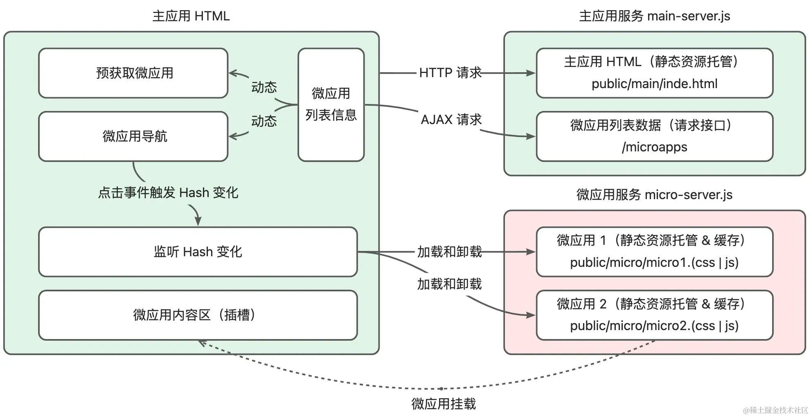
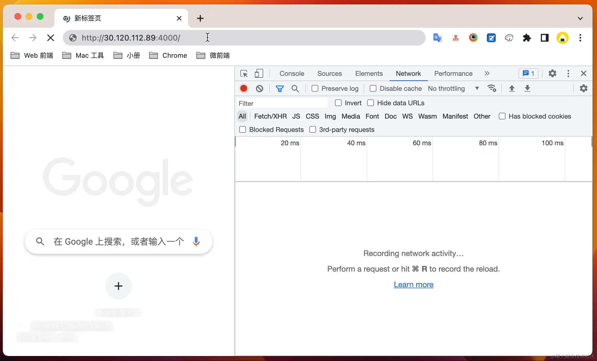

# 深入浅出微前端
## 方案了解
###  iframe 方案
需要注意跨站和跨域是有区别的，使用跨站而不是跨域来独立 `Renderer` 进程是为了兼容现有浏览器的能力，例如同站应用通过修改 `document.domain` 进行通信，如果采用域名隔离，那么会导致处于不同 `Renderer` 进程的应用无法实现上述能力(相同的站点的可以运行在不同的`renderer`上)。这里额外了解一下同源和同站的区别，如下所示：
- 同源：协议（protocol）、主机名（host）和端口（port）相同，则为同源；
- 同站：有效顶级域名（Effective Top-Level-Domain，eTLD）和二级域名相同，则为同站。
####  浏览器多进程架构
浏览器是一个多进程（Multi Process）的设计架构，通常在打开浏览器标签页访问 Web 应用时，多个浏览器标签页之间互相不会受到彼此的影响，例如某个标签页所在的应用崩溃，其他的标签页应用仍然可以正常运行，这和浏览器的多进程架构息息有关
以 Chrome 浏览器为例，在运行时会常驻 Browser 主进程，而打开新标签页时会动态创建对应的 Renderer 进程，两者的关系如下所示：


- **Browser 主进程：** 主要负责处理网络资源请求、用户的输入输出 UI 事件、地址栏 URL 管理、书签管理、回退与前进按钮、文件访问、Cookie 数据存储等。Browser 进程是一个常驻的主进程，它也被称为代理进程，会派生进程并监督它们的活动情况。除此之外，Browser 进程会对派生的进程进行沙箱隔离，具备沙箱策略引擎服务。Browser 进程通过内部的 I/O 线程与其他进程通信，通信的方式是 IPC & Mojo。
- **Renderer 进程：** 主要负责标签页和 iframe 所在 Web 应用的 UI 渲染和 JavaScript 执行。Renderer 进程由 Browser 主进程派生，每次手动新开标签页时，Browser 进程会创建一个新的 Renderer 进程。
####  浏览器沙箱隔离
由于 Web 应用运行在 Renderer 进程中，浏览器为了提升安全性，需要通过常驻的 Browser 主进程对 Renderer 进程进行沙箱隔离设计，从而实现 Web 应用进行隔离和管控，如下所示：

在 Chrome 浏览器的多进程架构中，Browser 进程对应 Broker 进程，可以理解为浏览器沙箱策略的总控制器， Renderer 进程对应沙箱化的 Target 进程，它主要运行不受信任的三方 Web 应用，因此，在 Renderer 进程中的一些系统操作需要经过 IPC 通知 Browser 进程进行代理操作，例如网络访问、文件访问（磁盘）、用户输入输出的访问（设备）等。
那么对于插件的的沙盒隔离呢：
- 插件的运行
  - **运行环境**：Chrome插件在独立的背景页（background page）或服务工作线程（service worker）中运行。
  - **权限与API**：插件有更高的权限和更多的API可供调用，可以跨越不同标签页和窗口操作，但受到Chrome策略的限制和管理。
- 插件如何在不同标签间操作
  - **消息传递** 插件可使用Chrome扩展API中的消息传递系统在不同标签页或窗口间通信，如 `chrome.runtime.sendMessage` 和 `chrome.tabs.sendMessage`。
  - **标签页管理** 通过 `chrome.tabs` API，插件可以查询、打开、关闭、刷新或修改标签页。
  - **权限要求** 实现跨标签页操作需在插件的manifest文件中声明相应权限，例如 `tabs`。
  - **内容脚本** 插件可以将内容脚本注入到特定页面，与网页内容直接交互，运行在与插件主体不同的上下文中。
  - **隔离和安全** 尽管插件有较高权限，Chrome限制了其可访问的网站和数据，以保护用户安全。

####  浏览器站点隔离

在 Chrome 浏览器中沙箱隔离以 Renderer 进程为单位，而在旧版的浏览器中会存在多个 Web 应用共享同一个 Renderer 进程的情况，此时浏览器会依靠同源策略来限制两个不同源的文档进行交互，帮助隔离恶意文档来减少安全风险。
[示例代码：](https://github.com/ziyi2/micro-framework/tree/demo/iframe-isolate)
####  浏览器上下文
主要有以下几种类型的浏览器上下文：
- **标签页上下文（Tab Context）**：每个打开的标签页都是一个独立的上下文。这意味着在不同的标签页中打开的网页彼此隔离，不会共享JavaScript的全局变量、Web存储等。
- **窗口上下文（Window Context）**：类似于标签页上下文，但是还包括浏览器窗口。弹出窗口（通过window.open创建）会创建新的窗口上下文。
- **框架上下文（Frame Context）**：内嵌框架（如<iframe>）拥有自己的上下文。它们在父页面中运行，但是有自己的文档对象模型（DOM）和JavaScript环境。
- **服务工作线程上下文（Service Worker Context）**：服务工作线程是一种独立于主浏览器线程的上下文，用于处理离线缓存、推送通知等。 
- **Web Workers上下文**：Web Workers允许在后台线程中执行脚本，与主浏览器线程完全隔离
#### 标签页上下文
**通信机制**
虽然标签页之间是隔离的，但有时我们需要在不同的标签页之间进行通信。这可以通过以下几种方式实现：
1. `LocalStorage/SessionStorage`：这两种存储机制可以在相同源的标签页之间共享数据。
2. `Cookies`：同样可以在相同源的标签页间共享。
3. `BroadcastChannel API`：这是一个比较新的API(在chrome上兼容性比较好)，允许同源的不同标签页或者窗口之间进行简单的通信。
4. `Window.postMessage`：用于在两个窗口之间安全地传递消息，包括跨源通信。
```js
// 使用LocalStorage进行通信：
// 在标签页A中：
localStorage.setItem('message', 'Hello World!');
// 在标签页B中：
window.addEventListener('storage', function(event) {
  console.log(event.newValue); // 'Hello World!'
});

// 使用BroadcastChannel API进行通信：
// 在标签页A中：
const channel = new BroadcastChannel('my_channel');
channel.postMessage('Hello World!');
// 在标签页B中：
const channel = new BroadcastChannel('my_channel');
channel.addEventListener('message', function(event) {
  console.log(event.data); // 'Hello World!'
});

// 使用Window.postMessage进行通信：
/*
 * A 窗口的域名是<http://example.com:8080>，以下是 A 窗口的 script 标签下的代码：
 */

var popup = window.open(...popup details...);

// 如果弹出框没有被阻止且加载完成

// 这行语句没有发送信息出去，即使假设当前页面没有改变 location（因为 targetOrigin 设置不对）
popup.postMessage("The user is 'bob' and the password is 'secret'",
    "https://secure.example.net");

// 假设当前页面没有改变 location，这条语句会成功添加 message 到发送队列中去（targetOrigin 设置对了）
popup.postMessage("hello there!", "http://example.com");

function receiveMessage(event)
{
    // 我们能相信信息的发送者吗？(也许这个发送者和我们最初打开的不是同一个页面).
    if (event.origin !== "http://example.com")
        return;

    // event.source 是我们通过 window.open 打开的弹出页面 popup
    // event.data 是 popup 发送给当前页面的消息 "hi there yourself!  the secret response is: rheeeeet!"
}
window.addEventListener("message", receiveMessage, false);
/*
 * 弹出页 popup 域名是 http://example.com，以下是 script 标签中的代码：
 */

//当 A 页面 postMessage 被调用后，这个 function 被 addEventListener 调用
function receiveMessage(event) {
    // 我们能信任信息来源吗？
    if (event.origin !== "http://example.com:8080") return;

    // event.source 就当前弹出页的来源页面
    // event.data 是 "hello there!"

    // 假设你已经验证了所受到信息的 origin (任何时候你都应该这样做), 一个很方便的方式就是把 event.source
    // 作为回信的对象，并且把 event.origin 作为 targetOrigin
    event.source.postMessage(
        "hi there yourself!  the secret response " + "is: rheeeeet!",
        event.origin,
    );
}

window.addEventListener("message", receiveMessage, false);

```
#### 窗口上下文

窗口上下文指的是与特定浏览器窗口或标签页关联的全局执行环境。在`JavaScript`中，这通常是通过window对象来访问的。每个浏览器窗口或标签页都有其自己的window对象，它包含了与该窗口相关的功能和属性。
1. 全局变量和函数
```js
// 全局变量
var globalVar = '我是一个全局变量';

// 全局函数
function globalFunction() {
    console.log('全局函数被调用');
}

// 通过window对象访问
window.globalFunction(); // 输出：全局函数被调用
console.log(window.globalVar); // 输出：我是一个全局变量

```
2. 事件处理
```js
window.addEventListener('resize', function() {
    console.log('窗口大小改变了!');
});
```

3. 窗口间通信
```js
// 打开一个新窗口
var newWindow = window.open('https://example.com');

// 发送消息到新窗口
newWindow.postMessage('Hello, new window!', 'https://example.com');
```
4. 窗口控制
```js
// 关闭当前窗口
window.close();
// 滚动到页面顶部
window.scrollTo(0, 0);
```

###  iframe 设计方案
在微前端中 iframe 方案需要一个主应用，包含导航和内容区的设计，通过切换导航来控制内容区微应用 A / B / C 的加载和卸载，如下所示：


逻辑，在 iframe 的方案中，导航设计可以是前端框架路由来控制不同微应用所在 iframe 的显示和隐藏，也可以通过自己设计切换逻辑来动态加载 iframe。

不论使用哪一种切换方式，在首次加载 iframe 应用时，都会因为服务端请求而导致内容区带来短暂的白屏效果。当然，相比普通 MPA 应用，通过服务端路由的方式来处理，最大的好处是每次切换微应用都不需要刷新主应用。除此之外，iframe 应用的特点主要包括：
- 站点隔离和浏览上下文隔离，可以使微应用在运行时天然隔离，适合集成三方应用；
- 移植性和复用性好，可以便捷地嵌在不同的主应用中。
当然在使用 iframe 应用时，会产生如下一些问题：
- 主应用刷新时， iframe 无法保持 URL 状态（会重新加载 src 对应的初始 URL）；
- 主应用和 iframe 处于不同的浏览上下文，无法使 iframe 中的模态框相对于主应用居中；
- 主应用和 iframe 微应用的数据状态同步问题：持久化数据和通信
### npm 方案
NPM 包是微前端设计方案之一，在设计时需要将微应用打包成独立的 NPM 包，然后在主应用中引入和使用。
对于js来说，并没有直接访问文件的方式，所以对于第三方库来说，我们可以通过以下几种方式来引入：
浏览器中的 JavaScript 由于受到了沙箱限制无法直接访问本地的文件（例如 `file://` 路径文件），因此在浏览器中使用模块化进行开发，无法像 Node 应用那样直接在 `JavaScript` 中通过 `require` 加载模块，只能通过 HTTP 请求的形式获取，因此在上述示例中，需要使用 Node.js 设计 `app.js` 启动 Web 服务：
前端访问文件的方式：
1. <input type="file"> 元素
```js
// HTML
<input type="file" id="fileInput">
// JavaScript
  document.getElementById('fileInput').addEventListener('change', function(event) {
  const file = event.target.files[0]; // 获取用户选择的第一个文件
  const reader = new FileReader(); // 创建一个 FileReader 对象用于读取文件
  
  reader.onload = function(e) {
  // 这个事件会在文件读取完成后触发
  console.log(e.target.result); // 文件内容会在 e.target.result 中
};
  
  reader.readAsText(file); // 读取文件内容，假设文件是文本格式
});
```
2. 拖放(Drag and Drop)
```js
// HTML
<div id="dropZone" style="border: 1px solid black; width: 300px; height: 100px;">
  拖拽文件到这里
</div>
// JavaScript
// 获取拖放区域的元素
const dropZone = document.getElementById('dropZone');

// 添加 dragover 事件监听器
dropZone.addEventListener('dragover', function(event) {
  event.preventDefault(); // 防止默认行为
});

// 添加 drop 事件监听器
dropZone.addEventListener('drop', function(event) {
  event.preventDefault(); // 防止默认行为
  
  // 获取拖放的文件
  const file = event.dataTransfer.files[0];
  
  // 创建 FileReader 对象
  const reader = new FileReader();
  
  // 设置文件读取完成后的回调函数
  reader.onload = function(e) {
    console.log(e.target.result); // 在控制台输出文件内容
  };
  
  // 开始读取文件内容
  reader.readAsText(file);
});


```
3. 粘贴板操作（Clipboard Operations）
```js
// 监听整个文档的粘贴事件 
document.addEventListener('paste', function(event) {
  // 获取粘贴事件中的剪贴板数据
  const items = event.clipboardData.items;
  
  // 遍历剪贴板中的每个项目
  for (let i = 0; i < items.length; i++) {
    // 检查项目类型是否是图片
    if (items[i].type.indexOf('image') === 0) {
      // 将剪贴板项转换为文件对象
      const file = items[i].getAsFile();
      
      // 创建 FileReader 对象来读取文件
      const reader = new FileReader();
      
      // 设置文件读取完成后的回调函数
      reader.onload = function(e) {
        // 输出文件（图片）内容
        console.log(e.target.result);
      };
      
      // 以数据URL的形式读取图片文件
      reader.readAsDataURL(file);
    }
  }
});

```
4. File System Access API
```js
async function openFile() {
  // 显示文件选择器
  // window.showOpenFilePicker() 弹出一个文件选择器对话框，让用户选择文件。这是一个异步操作，返回一个Promise。
  // 这个函数返回一个文件句柄数组（FileSystemFileHandle对象），每个句柄代表用户选择的一个文件。这里，我们通过解构赋值获取第一个文件句柄。
  [fileHandle] = await window.showOpenFilePicker();
  
  // 从文件句柄获取文件对象
  const file = await fileHandle.getFile();
  
  // 读取文件内容
  const contents = await file.text();
  
  // 打印文件内容
  console.log(contents);
}

```

#### 模块化
在设计时需要将微应用打包成独立的 NPM 包，然后在主应用中引入和使用。实际就是一个第三方库，提供的功能不同罢了。一般可以放在public中，避免被打包。
同时，通过模块化可以将全局的状态进行隔离，避免污染全局变量，同时也可以避免不同微应用之间的变量冲突。
#### 构建工具
在微前端设计方案中，需要将微应用打包成独立的 NPM 包，然后在主应用中引入和使用，因此需要使用构建工具来打包微应用，常见的构建工具有 Webpack、Rollup、Parcel 等。
#### npm 的设计案例
##### Monorepo 结构：
Monorepo（单一仓库）是一种代码仓库的管理策略，它指的是在一个单一的版本控制系统仓库中维护多个项目或包。这与将每个项目或包放在独立的仓库中（多仓库，或 Polyrepo）的策略形成对比。Monorepo 在大型组织和复杂项目中特别流行，如 Google、Facebook 和 Twitter。
**Monorepo 的特点**
1. 统一的代码库：所有项目和包共享同一个仓库。
2. 便于共享代码：易于在项目之间共享代码和资源，因为它们都在同一个仓库中。
3. 简化的依赖管理：管理依赖关系更为简单，因为所有项目都可以引用同一个仓库中的代码。
4. 统一的版本控制：所有项目的历史记录都保存在同一个地方，便于跟踪和管理。
5. 协同工作：团队成员可以更容易地跨项目合作，因为所有代码都在同一个地方。
**Monorepo 的挑战**
1. 仓库过大：Monorepo 仓库可能会变得非常大，因为它包含了所有项目的代码。
2. 依赖冲突：如果项目之间共享依赖关系，那么当其中一个项目更新依赖关系时，可能会影响到其他项目。
3. 构建优化：大型项目可能需要更复杂的构建和测试策略来优化性能。
4. 工具支持：需要特殊工具和策略来管理大规模的 Monorepo，例如 Lerna、Yarn Workspaces。

##### Lerna
Lerna 是一个优化管理多个包的 JavaScript 项目的工具，常用于管理大型项目中的多个包，如在一个单一的仓库（monorepo）中
**Lerna 的使用原理和优势**
1. 单一仓库（Monorepo）管理多个包：Lerna 允许您在一个仓库中管理多个 npm 包，这有助于代码共享和依赖管理。
2. 版本管理：Lerna 可以统一管理多个包的版本，包括版本同步和独立版本管理。
3. 依赖关系管理：Lerna 优化了包之间的依赖关系，当一个包更新时，依赖它的包可以被自动更新。
4. 优化安装过程：通过链接本地包，Lerna 可以减少重复安装相同依赖的时间。

**使用 Lerna 的基本步骤**
```js
// 1. 安装 Lerna
npm install --global lerna
// 2. 初始化 Lerna 仓库
lerna init
// 3. 创建包
lerna create <package-name>
// 4. 添加包依赖
lerna add <package>[@version] [--dev] [--exact]
// 5. 安装依赖
lerna bootstrap
// 6. 发布包
lerna publish
// demo
// 1. 初始化 Lerna 仓库
lerna init
// 2. 创建包
lerna create micro-app/core
lerna create micro-app/utils
lerna create micro-app/react
lerna create micro-app/vue
// 3. 添加包依赖
lerna add micro-app/utils
lerna add micro-app/core
lerna add micro-app/core --scope=micro-app/react
lerna add micro-app/core --scope=micro-app/vue
// 4. 安装依赖
lerna bootstrap
// lerna.json
{
  "packages": [
    "packages/*"
  ],
  "version": "0.0.0"
}

```

### 动态script标签方案
动态 script 标签方案是微前端设计方案之一，通过动态创建 script 标签的方式来加载微应用，如下所示：
<div>

</div>
实现效果如下所示，图中的两个按钮（微应用导航）根据后端数据动态渲染，点击按钮后会请求微应用的静态资源并解析相应的 JS 和 CSS，并渲染微应用的文本信息到插槽中：
<div>

</div>

整体的设计如下：
1. 首先访问`index.html`主页面，通过`prefetch`请求后端对应的数据使用`as`来确定数据的类型，
2. 拿到不同子应用到数据，获得初始化和对应的子应用的全局方法，主要是挂载卸载以及对应的生命周期，进行数据的处理。
3. 通过监听`hashchange`事件，来切换不同的子应用，通过`window.location.hash`来获取对应的子应用的`hash`值，然后通过`window['app'+hash]`来获取对应的子应用的全局方法，然后进行挂载和卸载。
4. 在切换的时候，会先卸载之前的子应用，然后再挂载新的子应用，这样就可以实现不同子应用的切换了。
5. 在卸载的时候根据设计选择卸载不同的方式，这里是`link`标签，删除对应的浏览器的缓存资源。也可以删除对应的`script`标签，这样就可以实现对应的卸载了。
源代码：
[示例代码：](https://github.com/ziyi2/micro-framework/tree/demo/dynamic-script)

### Web Components 方案

和动态script很类似，对比动态 Script 的方案可以发现 Web Components 的优势如下所示：

复用性：不需要对外抛出加载和卸载的全局 API，可复用能力更强
标准化：W3C 的标准，未来能力会得到持续升级（说不定支持了 JS 上下文隔离）
插拔性：可以非常便捷的进行移植和组件替换
当然使用 Web Components 也会存在一些劣势，例如：

兼容性：对于 IE 浏览器不兼容，需要通过 Polyfill 的方式进行处理
学习曲线：相对于传统的 Web 开发，需要掌握新的概念和技术


### iframe cookie 方案


### ajax cookie 方案
在通过请求来获取数据，主要是用户的认证，有很多方式，这里说明的时候cookie的方式，这个方式的实现主要是解决cookie的跨域问题。
#### http
http协议是无状态的，也就是说每次请求都是独立的，不会记录上一次的请求，所以需要通过cookie来记录用户的状态，这样就可以实现用户的认证了。
直接使用cors来解决，定向的设置对应的域名，这样就可以实现对应的跨域了。

#### https
https是http的安全版本，主要是通过ssl来实现的，所以在https中，cookie是安全的，不会被劫持，所以可以直接使用cookie来实现对应的认证了。
使用nginx和mkcert来实现https的配置，这样就可以实现对应的https的配置了。
```js
const cookieOptions = { sameSite: 'none', secure: true }
  // 设置一个响应的 Cookie 数据
  res.cookie('micro-app', true, cookieOptions)
```
#### 方案说明：
使用ihost 和 mkcert 和 nginx 来实现：
通过ihost来实现对应的域名的配置，通过mkcert来实现对应的证书的配置，通过nginx来实现对应的代理的配置，这样就可以实现对应的https的配置了。

## 原理解析
### 前言
#### 状态
`qiankun` 内部的应用状态变更主要依赖 `single-spa`，`single-spa` 框架类似于浏览器应用的生命周期管理。
#### 隔离
- iframe 隔离： 空白页（src="about:blank"） iframe 隔离和服务端同源的 iframe 隔离方案设计。不仅可以利用不同的浏览上下文实现彻底的微应用隔离，与普通 iframe 方案而言，还可以解决白屏体验问题，是微前端框架实现隔离的重要手段；
- iframe + Proxy 隔离： 解决空白页 iframe 隔离无法调用 history API 的问题，并可用于解决 iframe 方案中无法处理的 URL 状态同步问题；
- 快照隔离： 浏览器无法兼容 Proxy 时，可以通过简单的快照实现 window 变量的隔离，但是这种隔离方案限制较多，例如无法实现主子应用的隔离，无法实现多个微应用并存的隔离。当然大多数场景是一个时刻运行一个微应用，因此是一种兼容性良好的隔离方案；
CSS 隔离： 如果主应用和微应用同处于一个 DOM 上下文，那么需要考虑 CSS 样式的隔离处理。课程中会重点讲解 Shadow DOM 实现 CSS 隔离的示例以及产生的弊端。

#### 性能
浏览器和服务器为了提升应用的加载性能，不断的开放了更多相关的功能，包括 Resource Hints（DNS Prefetch、Preconnect、Prefetch、Prerender）、Preload、Early Hints 等。除此之外，在应用缓存方面还可以做到多级缓存设计，包括 Memory Cache、Service Worker & Cache、Disk Cache、HTTP 缓存、 HTTP2 / Push 缓存、CDN 缓存和代理缓存等。除了上述一些功能，还可以从微应用本身出发进行性能优化，包括资源共享、预加载和预渲染等。
#### 通信
主子应用之间可以通过观察者模式或者发布订阅模式实现通信，如果是跨域的 iframe 则可以通过 window.postMessage 实现通信，如果是同域的 SPA 应用，则可以通过浏览器原生的 EventTarget 或者自定义通信对象

### V8隔离
简单来说就是通过不同的沙箱来实现对应的隔离，这样就可以实现对应的隔离了。因为浏览器并没有提供对应的隔离的功能。所以还是利用iframe来实现对应的隔离，或者是跨站跳转来实现对应的隔离。
### iframe 隔离
+ 阶段一：加载空白的 iframe 应用，例如 src="about:blank"，生成新的微应用执行环境
  + 解决全局执行上下文隔离问题
  + 解决加载 iframe 的白屏体验问题
+ 阶段二：加载同源的 iframe 应用，返回空的内容，生成新的微应用执行环境
  + 解决全局执行上下文隔离问题
  + 解决加载 iframe 的白屏体验问题
  + 解决数据状态同步问题
  + 解决前进后退问题
### iframe + Proxy 隔离
+ 阶段一：加载空白的 iframe 应用，例如 src="about:blank"，生成新的微应用执行环境
  + 解决全局执行上下文隔离问题
  + 解决加载 iframe 的白屏体验问题
  + 解决数据状态同步问题
  + 解决前进后退问题
  + 解决 URL 状态同步问题
  + 解决 history API 问题
+ 阶段二：加载同源的 iframe 应用，返回空的内容，生成新的微应用执行环境
+ 阶段三：加载同源的 iframe 应用，返回真实的内容，生成新的微应用执行环境
  + 解决全局执行上下文隔离问题
  + 解决加载 iframe 的白屏体验问题
  + 解决数据状态同步问题
  + 解决前进后退问题
  + 解决 URL 状态同步问题
  + 解决 history API 问题
### 快照隔离 
+ 阶段一：加载空白的 iframe 应用，例如 src="about:blank"，生成新的微应用执行环境
  + 解决全局执行上下文隔离问题
  + 解决加载 iframe 的白屏体验问题
  + 解决数据状态同步问题
  + 解决前进后退问题
  + 解决 URL 状态同步问题
  + 解决 history API 问题
+ 阶段二：加载同源的 iframe 应用，返回空的内容，生成新的微应用执行环境
+ 阶段三：加载同源的 iframe 应用，返回真实的内容，生成新的微应用执行环境
  + 解决全局执行上下文隔离问题
  + 解决加载 iframe 的白屏体验问题
  + 解决数据状态同步问题
  + 解决前进后退问题
  + 解决 URL 状态同步问题
  + 解决 history API 问题
### CSS 隔离
+ 阶段一：加载空白的 iframe 应用，例如 src="about:blank"，生成新的微应用执行环境
  + 解决全局执行上下文隔离问题
  + 解决加载 iframe 的白屏体验问题
  + 解决数据状态同步问题
  + 解决前进后退问题
  + 解决 URL 状态同步问题
  + 解决 history API 问题
  + 解决 CSS 隔离问题
  + 解决样式污染问题
+ 阶段二：加载同源的 iframe 应用，返回空的内容，生成新的微应用执行环境
+ 阶段三：加载同源的 iframe 应用，返回真实的内容，生成新的微应用执行环境
  + 解决全局执行上下文隔离问题
  + 解决加载 iframe 的白屏体验问题
  + 解决数据状态同步问题
  + 解决前进后退问题
  + 解决 URL 状态同步问题
  + 解决 history API 问题
  + 解决 CSS 隔离问题
  + 解决样式污染问题
### 通信
主要是两种方式，一种是通过观察者模式或者是发布订阅模式，另一种是通过window.postMessage来实现对应的通信。
### 性能
主要是通过资源共享，预加载和预渲染来实现对应的性能优化。
## 框架解析


## 原理进阶
### V8的嵌入实践


